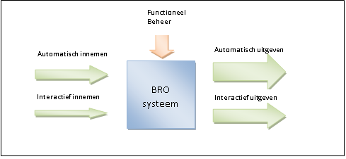
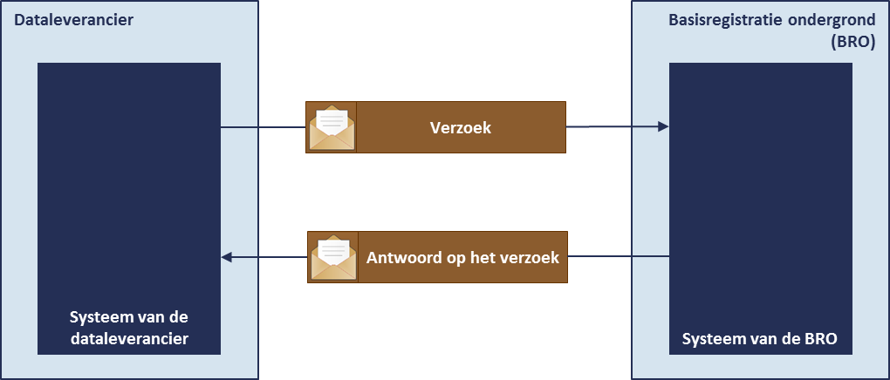

# Algemene opzet BasisRegistratieOndergrond

## Informatieketen BRO

### Inname van gegevens via BRO
De basisregistratie ondergrond is een systeem dat een schakel vormt in een informatieketen. Aan het begin van de keten staan bestuursorganen die opdracht geven tot de productie van gegevens, of zelf gegevens produceren. Die bestuursorganen worden bronhouders genoemd. De geproduceerde gegevens worden door een dataleverancier geleverd aan de beheerder van het systeem, de *registerbeheerder*. De *bronhouder* is verantwoordelijk voor de levering van gegevens. Hij kan besluiten zelf dataleverancier te zijn of andere partijen een machtiging voor levering te verlenen. De beheerder van de BRO registreert de aangeleverde gegevens en levert ze voor (her)gebruik door aan allerlei afnemers. 

Een organisatie kan niet zomaar gegevens aan de BRO aanbieden. Een organisatie moet zich eerst als *dataleverancier* bij de registerbeheerder hebben laten registreren en de registratie is gekoppeld aan een bepaald type registratieobject. Om de grondwatermonitoringput aan te mogen bieden moet een organisatie zich als *dataleverancier van de grondwatermonitoringput* laten registreren.

Wanneer een bronhouder zelf gegevens wil aanbieden, is er sprake van een bilaterale overeenkomst en kan de bronhouder zich direct als dataleverancier laten registreren. Wanneer een intermediaire partij namens een bronhouder gegevens wil aanleveren, is sprake van een overeenkomst tussen drie partijen. 

### Uitgifte van gegevens via BRO
Iedereen mag gegevens opvragen uit de registratie ondergrond en men kan daarbij kiezen uit twee mogelijkheden, via DINOloket of via een uitgiftewebservice. De verschillen tussen de twee zijn groot en wat de gebruiker kiest hangt af van zijn informatiebehoefte en de technische mogelijkheden waarover hij beschikt. 
DINOloket biedt een laagdrempelige manier voor het opvragen van gegevens die door iedereen kan worden gebruikt. De webservice geeft meer direct toegang tot de registratie, maar vraagt wel dat de gebruiker over geschikte software beschikt. 

### DINO*Loket*
DINOloket is een website die toegang geeft tot de gegevens van alle registratieobjecten in de BRO. Het gebruik van de website stelt geen bijzondere eisen. De gebruiker kan op de website bepalen in welke objecten hij geïnteresseerd is, de belangrijkste gegevens daarvan bekijken en uiteindelijk besluiten van welke objecten hij gegevens wil aanvragen. De opgevraagde gegevens worden hem vervolgens per e-mail toegestuurd. Het enige wat van de data-afnemer gevraagd wordt is dat hij bij het indienen van zijn aanvraag zijn e-mailadres opgeeft. 

DINOloket biedt niet alleen toegang tot de registratieobjecten in de BRO, maar ook tot de gegevens in het systeem DINO. De keuzemogelijkheden zijn groot en de gebruiker wordt door het selectieproces geleid zodat hij stapsgewijs kan bepalen welke gegevens hij wil opvragen. Het loket biedt de gebruiker de mogelijkheid gegevens uit DINO en de BRO te combineren.
Gegevens uit DINO worden uitgegeven in een formaat dat aansluit bij de bestaande praktijk. De gegevens uit de BRO worden standaard uitgegeven in IMBRO-XML formaat. Wanneer dat nodig is wordt naast het IMBRO-XML-formaat nog een ander formaat ondersteund.
 
DINOloket is zo gebouwd dat de gebruiker eigenlijk geen fouten kan maken bij het invoeren van zijn keuze zodat de gegevens die hij opvraagt ook zonder problemen geleverd kunnen worden.

## Interactiemogelijkheden met de BRO
Het BRO systeem is als basisregistratie in essentie een systeem voor innemen, beheer en uitgeven van gegevens.

Het innemen en uitgeven van gegevens verloopt idealiter volledig automatisch, waarbij externe systemen van leveranciers en afnemers via gestandaardiseerde koppelvlakken verbonden zijn met het BRO systeem. Voor een laagdrempelige toegang ondersteunt het BRO systeem ook interactief innemen en uitgeven van gegevens. 
Om de goede werking van het systeem en de kwaliteit van de gegevens te borgen, vindt functioneel beheer  plaats.

### Communicatie tussen systemen
Om geautomatieseerde inname en uitgifte van gegevens mogelijk te maken moeten systemen met elkaar kunnen communiceren. Deze communicatie vindt plaats via zogeheten *webservices*. Het adres van de BRO-webservices is te vinden op www.broinfo.nl.

### Inname webservice
De dataleverancier die voor het aanbieden van gegevens van een registratieobject gebruik maakt van de innamewebservice, gebruikt via zijn eigen systeem algemene BRO-software die via het internet voor iedereen te vinden is. 

De webservice zorgt ervoor dat het systeem van de data-leverancier een verzoek tot het innemen van gegevens aan het BRO-systeem kan aanbieden, zorgt voor de verwerking van het verzoek en geeft het resultaat daarvan als antwoord van de BRO terug aan het systeem van de dataleverancier (Figuur 2). 

### Uitgifte webservice
De data-afnemer die voor het opvragen van gegevens van grondwatermonitoringputten gebruik maakt van de uitgiftewebservice, gebruikt via zijn eigen systeem algemene BRO-software die via het internet voor iedereen te vinden is.  

De webservice zorgt ervoor dat het systeem van de data-afnemer een verzoek tot verzending van een grondwatermonitoringput aan het BRO-systeem kan aanbieden, zorgt voor de verwerking van het verzoek en geeft het antwoord van de BRO terug aan het systeem van de data-afnemer (Figuur 2). Als alles goed is gegaan bevat het antwoord de opgevraagde gegevens.

## Innameproces
De gegevens van een registratieobject worden altijd via de *innamewebservice* aangeboden. De dataleverancier die de innamewebservice wil gebruiken moet over software beschikken die de webservice kan aanroepen. Met de eigen software heeft hij dan direct toegang tot het systeem van de basisregistratie ondergrond, het BRO-systeem, en kan hij snel en op betrouwbare wijze gegevens aanbieden.
Om zich bij de registerbeheerder als gebruiker van de webservice te laten registreren, moet de organisatie van de dataleverancier beschikken over een *PKIoverheid services certificaat*.

De gegevens die via de innamewebservice aan de BRO worden overgedragen staan in het IMBRO-XML formaat. Het IMBRO-XML formaat is de gegevensdefinitie omgezet naar de technische taal die voor de uitwisseling van gegevens met het systeem van de BRO gebruikt wordt. De technische uitwerking wordt toegelicht in de koppelvlakbeschrijving van de innamewebservice.

## Verwerking van een innameverzoek

## Verwerking van een correctieverzoek

## Registratie-object met levensloop

## Conversie registratie-object met voorgeschiedenis
