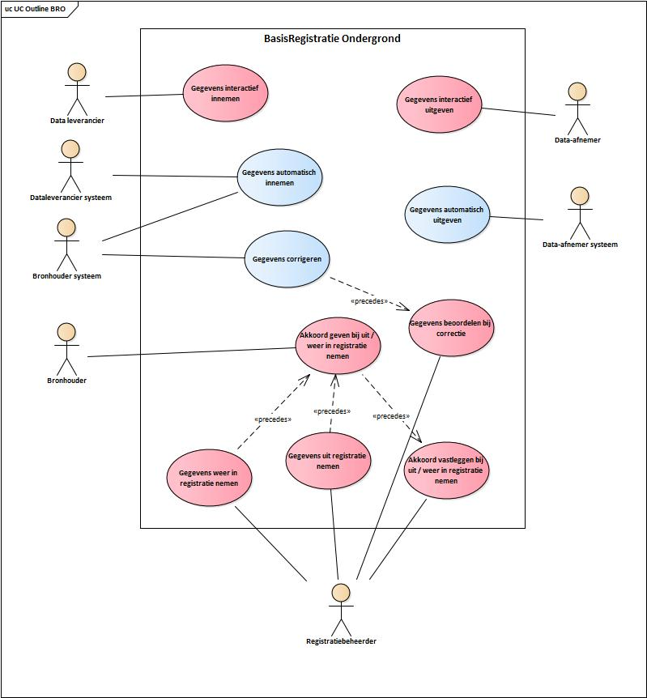
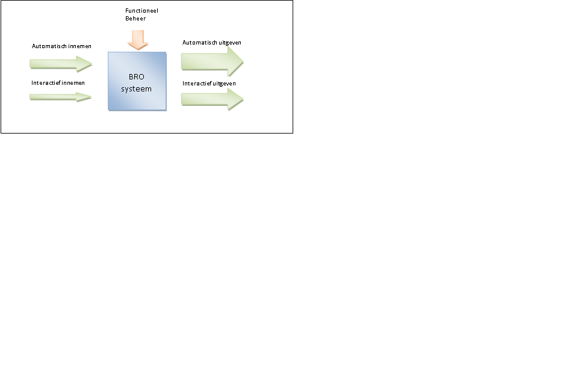
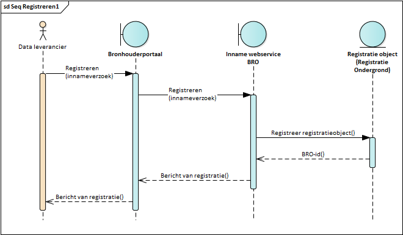
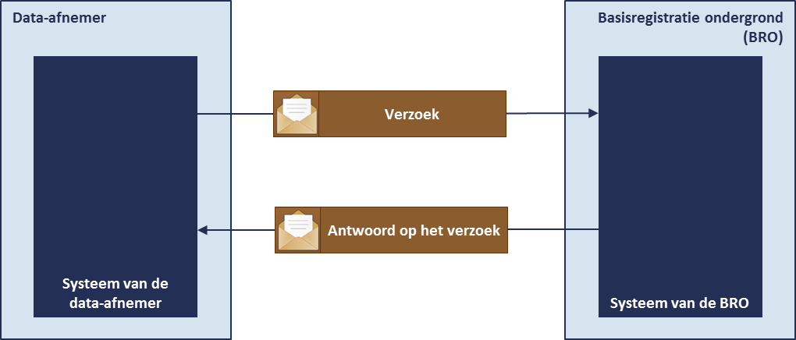

# Informatieketen

## Het BRO-systeem
De basisregistratie ondergrond (BRO) is een systeem dat een schakel vormt in een informatieketen. Aan het begin van de keten staan bestuursorganen die opdracht geven tot de productie van gegevens, of zelf gegevens produceren. Die bestuursorganen worden *bronhouders* genoemd. De geproduceerde gegevens worden door een *dataleverancier* geleverd aan de beheerder van het systeem, de *registerbeheerder*. De *bronhouder* is verantwoordelijk voor de levering van gegevens. Hij kan besluiten zelf *dataleverancier* te zijn of andere partijen een machtiging voor levering te verlenen. De beheerder van de BRO registreert de aangeleverde gegevens en levert ze voor (her)gebruik door aan *data-afnemers*.

 Bovenstaand diagram geeft een overzicht van de belangrijkste BRO-functionaliteiten (use cases) en de daarbij horende belanghebbenden (actoren). 
 
 Een korte toelichting:
 * De actoren geven de **rollen** aan waarmee belanghebbenden met het systeem kunnen interacteren. Het kunnen personen, organisaties en systemen zijn die een bepaalde rol hebben. Voorbeeld: een organisatie kan zowel als *bronhouder* alsmede als *dataleverancier* optreden bij de BRO; in dit geval twee rollen dus.
 * Dit scope van dit document is het geautomatiseerd innemen en uitgeven van gegevens. Het use-case diagram geeft een breed overzicht van de BRO systeem-use-cases. Voor dit document zijn de blauw gekleurde use-cases in scope.

## Interactiemogelijkheden met de BRO
Het BRO systeem is als basisregistratie in essentie een systeem voor innemen, beheer en uitgeven van gegevens.

Het innemen en uitgeven van gegevens verloopt idealiter volledig automatisch, waarbij externe systemen van leveranciers en afnemers via gestandaardiseerde koppelvlakken verbonden zijn met het BRO systeem. Voor een laagdrempelige toegang ondersteunt het BRO systeem ook interactief innemen en uitgeven van gegevens. 
Om de goede werking van het systeem en de kwaliteit van de gegevens te borgen, vindt functioneel beheer  plaats.

### Communicatie tussen systemen
Om geautomatieseerde inname en uitgifte van gegevens mogelijk te maken moeten systemen met elkaar kunnen communiceren. Deze communicatie vindt plaats via zogeheten *webservices*. Informatiesystemen kunnen aan de BRO gekoppeld worden met behulp van BRO-software die te vinden is op http://www.broinfo.nl.
 
## Inname van gegevens door de BRO
De dataleverancier biedt gegevens aan met het doel de gegevens op te laten nemen in de registratie ondergrond. Het proces van inname begint aan de kant van de dataleverancier met een verzoek. Vervolgens beoordeelt de basisregistratie ondergrond dat verzoek om, als alles goed is, de gegevens in het systeem op te nemen. Gaat er iets onverhoopt fout, dan wijst de basisregistratie ondergrond het verzoek af. In alle gevallen krijgt de dataleverancier een antwoord op het verzoek terug. 

De basisregistratie ondergrond handelt de verzoeken altijd per object af. Dat wil zeggen één grondwatermonitoringput tegelijk. Het begrip innameverzoek heeft in de context van de basisregistratie ondergrond altijd betrekking op één grondwatermonitoringput.

De gegevens die onderwerp zijn van een innameverzoek, vormen een geheel en dat wordt in de taal van de basisregistratie ondergrond een brondocument genoemd. Een brondocument bevat de gegevens die de dataleverancier van een bepaald object overdraagt aan de basisregistratie ondergrond. 

Er bestaan twee categorieën innameverzoeken. Het hangt er namelijk vanaf wat de dataleverancier precies beoogt. 
Wil een leverancier nieuwe gegevens aan de BRO overdragen die net beschikbaar zijn gekomen, of wil hij fouten verbeteren in de gegevens die al aanwezig zijn. In de basisregistratie ondergrond spreekt men van registratieverzoeken, resp. correctieverzoeken. 
De verwerking van registratieverzoeken verloopt anders dan van correctieverzoeken. 

Via een innameverzoek kan een dataleverancier niet alle gegevens van een registratieobject laten verwijderen. Verwijderen, of beter het uit registratie nemen van een object is een ingrijpende verandering in de registratie ondergrond, en daartoe kan pas worden besloten na zorgvuldig onderzoek. Het onderzoek begint bij de registratiebeheerder en uiteindelijk kan een object alleen na akkoord van de bronhouder uit registratie genomen worden. Het is bovendien goed om te weten dat de gegevens niet uit de registratie verwijderd worden. De gegevens blijven bestaan maar zijn niet langer voor gebruikers toegankelijk.

### Geautomatiseerde inname - innamewebservice
Geautomatiseerde inname van gegevens verloopt altijd via de *innamewebservice*. De innamewebservice zorgt ervoor dat:
* het systeem van de data-leverancier een verzoek tot het innemen van gegevens aan het BRO-systeem kan aanbieden
* het verzoek verwerkt wordt
* het resultaat van de verwerking als antwoord van de BRO terug aan het systeem van de dataleverancier gegeven wordt. 
Met eigen software heeft de dataleverancier dan direct toegang tot het systeem van de basisregistratie ondergrond, het BRO-systeem, en kan hij snel en op betrouwbare wijze gegevens aanbieden.

Om zich bij de registerbeheerder als gebruiker van de webservice te laten registreren, moet de organisatie van de dataleverancier beschikken over een *PKIoverheid services certificaat*.
De gegevens die via de innamewebservice aan de BRO worden overgedragen staan in het IMBRO-XML formaat. Het IMBRO-XML formaat is de gegevensdefinitie omgezet naar de technische taal die voor de uitwisseling van gegevens met het systeem van de BRO gebruikt wordt. De technische uitwerking wordt toegelicht in de koppelvlakbeschrijving van de innamewebservice.

## Uitgifte van gegevens uit de BRO
Iedereen mag gegevens opvragen uit de basisregistratie ondergrond en men kan daarbij kiezen uit twee mogelijkheden, via *DINOloket* of via een *uitgiftewebservice*. De verschillen tussen de twee zijn groot en wat de gebruiker kiest hangt af van zijn informatiebehoefte en de technische mogelijkheden waarover hij beschikt. 
DINOloket biedt een laagdrempelige manier voor het opvragen van gegevens die door iedereen kan worden gebruikt. De webservice geeft een meer directe toegang tot de registratie, maar vereist wel dat de gebruiker over geschikte software beschikt. 

### DINO*Loket*
DINOloket is een website die toegang geeft tot de gegevens van alle registratieobjecten in de BRO. Het gebruik van de website stelt geen bijzondere eisen. De gebruiker kan op de website bepalen in welke objecten hij geïnteresseerd is, de belangrijkste gegevens daarvan bekijken en uiteindelijk besluiten van welke objecten hij gegevens wil aanvragen. De opgevraagde gegevens worden hem vervolgens per e-mail toegestuurd. Het enige wat van de data-afnemer gevraagd wordt is dat hij bij het indienen van zijn aanvraag zijn e-mailadres opgeeft. 

DINOloket biedt niet alleen toegang tot de registratieobjecten in de BRO, maar ook tot de gegevens in het systeem DINO. De keuzemogelijkheden zijn groot en de gebruiker wordt door het selectieproces geleid zodat hij stapsgewijs kan bepalen welke gegevens hij wil opvragen. Het loket biedt de gebruiker de mogelijkheid gegevens uit DINO en de BRO te combineren.
Gegevens uit DINO worden uitgegeven in een formaat dat aansluit bij de bestaande praktijk. De gegevens uit de BRO worden standaard uitgegeven in IMBRO-XML formaat. Wanneer dat nodig is wordt naast het IMBRO-XML-formaat nog een ander formaat ondersteund.
 
DINOloket is zo gebouwd dat de gebruiker eigenlijk geen fouten kan maken bij het invoeren van zijn keuze zodat de gegevens die hij opvraagt ook zonder problemen geleverd kunnen worden.

### Geautomatiseerde uitgifte - uitgiftewebservice
De uitgiftewebservice zorgt ervoor dat het systeem van de data-afnemer een verzoek tot verzending van een grondwatermonitoringput aan het BRO-systeem kan aanbieden, zorgt voor de verwerking van het verzoek en geeft het antwoord van de BRO terug aan het systeem van de data-afnemer (Figuur 2). Als alles goed is gegaan bevat het antwoord de opgevraagde gegevens.

Opvragen van gegevens via de uitgiftewebservice verloopt heel anders dan via het loket. De gebruiker die via de webservice gegevens opvraagt krijgt de gegevens onmiddellijk geleverd. Maar om de webservice te kunnen gebruiken moet hij wel over software beschikken die de webservice kan aanroepen en moet hij zich als data-afnemer bij de BRO laten registreren. De eis die daarbij wordt gesteld is dat de organisatie waar hij werkt beschikt over een PKIoverheid services certificaat. Dat certificaat is een soort digitaal paspoort, het legitimatiebewijs van het softwaresysteem van de gebruiker. 

Opvragen van gegevens via de uitgiftewebservice is snel, betrouwbaar en elementair. Dat laatste betekent in de eerste plaats dat er voor ieder type registratieobject een aparte webservice is. Wil men gegevens van meer dan een type opvragen, dan moet men verschillende webservices gebruiken. Verder heeft de gebruiker beperkte keuzevrijheid. Hij kan of alle gegevens van een enkel registratieobject opvragen of een beperkte selectie van gegevens van een aantal registratieobjecten tegelijk. De reden daarachter is dat een webservice alleen in algemene gebruikerswensen voorziet. De eigen software van de data-afnemer moet zo zijn ingericht dat de webservice wordt aangeroepen op een manier die aansluit op   de eigen bedrijfsprocessen.

Het proces van uitgifte is bij het gebruik van de webservice strikt geformaliseerd. De webservice verzorgt de communicatie tussen twee softwaresystemen en om te borgen dat de verwerking van een verzoek automatisch kan verlopen zijn er allerlei controles ingebouwd. Een ander verschil is dat men de gegevens altijd in het IMBRO-XML formaat krijgt. 

## Kwaliteitsregimes

De basisregistratie ondergrond stelt stringente eisen aan de gegevens van registratieobjecten. Er zijn echter veel gegevens van vóór de datum waarop de wet in werking is getreden. Die gegevens kunnen niet altijd aan dezelfde eisen voldoen als gegevens die na de inwerkingtreding van de wet ontstaan. Omdat de al bestaande gegevens waardevol zijn, heeft de wetgever besloten dat de basisregistratie ook die gegevens moet bevatten. Zodoende kent de BRO twee kwaliteitsregimes voor registratieobjecten: 

1.	het kwaliteitsregime dat aangeeft dat een registratieobject aan de meest stringente eisen voldoet: IMBRO;
2.	het kwaliteitsregime dat aangeeft dat een registratieobject aan minder stringente eisen voldoet: IMBRO/A.

De objecten die zich naar de stringente regels voegen, zijn te herleiden tot een brondocument met kwaliteit IMBRO, en de overige tot een brondocument met kwaliteit IMBRO/A. 

Om aansluiting op de BRO te vergemakkelijken is een periode van transitie voorzien voor nieuw geconstrueerde putten. In de periode van transitie is de aanlevering van het brondocument GMW-Inrichten in IMBRO en IMBRO/A toegestaan. De duur van de transitie voor de grondwatermonitoringput is nog niet bepaald. Na afloop van de transitieperiode mag alleen IMBRO worden aangeleverd.

Het kwaliteitsregime van het object grondwatermonitoringput wordt bepaald door de kwaliteit van het brondocument dat bij het starten van registratie wordt ingenomen. 
Het kwaliteitsregime van een object kan veranderen, maar alleen na het doorvoeren van een specifieke correctie. De noodzaak tot deze correctie zal zich zeer zelden voordoen. Correctie van het kwaliteitsregime is namelijk alleen mogelijk tijdens de periode van transitie en alleen voor nieuwe putten.
