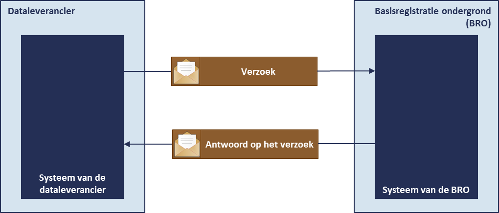

# Innamehandboek - functioneel perspectief

## Gegevens aanbieden
De basisregistratie ondergrond is een systeem dat een schakel vormt in een informatieketen. Aan het begin van de keten staan bestuursorganen die opdracht geven tot de productie van gegevens, of zelf gegevens produceren. Die bestuursorganen worden bronhouders genoemd. De geproduceerde gegevens worden door een dataleverancier geleverd aan de beheerder van het systeem, de *registerbeheerder*. De *bronhouder* is verantwoordelijk voor de levering van gegevens. Hij kan besluiten zelf dataleverancier te zijn of andere partijen een machtiging voor levering te verlenen. De beheerder van de BRO registreert de aangeleverde gegevens en levert ze voor (her)gebruik door aan allerlei afnemers. 

Een organisatie kan niet zomaar gegevens aan de BRO aanbieden. Een organisatie moet zich eerst als *dataleverancier* bij de registerbeheerder hebben laten registreren en de registratie is gekoppeld aan een bepaald type registratieobject. Om de grondwatermonitoringput aan te mogen bieden moet een organisatie zich als *dataleverancier van de grondwatermonitoringput* laten registreren.

Wanneer een bronhouder zelf gegevens wil aanbieden, is er sprake van een bilaterale overeenkomst en kan de bronhouder zich direct als dataleverancier laten registreren. Wanneer een intermediaire partij namens een bronhouder gegevens wil aanleveren, is sprake van een overeenkomst tussen drie partijen. 

De gegevens van de grondwatermonitoringput worden altijd via de *innamewebservice aangeboden*. De dataleverancier die de innamewebservice wil gebruiken moet over software beschikken die de webservice kan aanroepen. Met de eigen software heeft hij dan direct toegang tot het systeem van de basisregistratie ondergrond, het BRO-systeem, en kan hij snel en op betrouwbare wijze gegevens aanbieden.
Om zich bij de registerbeheerder als gebruiker van de webservice te laten registreren, moet de organisatie van de dataleverancier beschikken over een *PKIoverheid services certificaat*.

De gegevens die via de innamewebservice aan de BRO worden overgedragen staan in het IMBRO-XML formaat. Het IMBRO-XML formaat is de gegevensdefinitie omgezet naar de technische taal die voor de uitwisseling van gegevens met het systeem van de BRO gebruikt wordt. De technische uitwerking wordt toegelicht in de koppelvlakbeschrijving van de innamewebservice.

## Communicatie tussen systemen
De dataleverancier die voor het aanbieden van gegevens van de grondwatermonitoringput gebruik maakt van de innamewebservice, gebruikt via zijn eigen systeem algemene BRO-software die via het internet voor iedereen te vinden is. 
Het adres van de BRO-webservices is te vinden op www.broinfo.nl. 

De webservice zorgt ervoor dat het systeem van de data-leverancier een verzoek tot het innemen van gegevens aan het BRO-systeem kan aanbieden, zorgt voor de verwerking van het verzoek en geeft het resultaat daarvan als antwoord van de BRO terug aan het systeem van de dataleverancier.

## Innameverzoek

## Verwerking van een innameverzoek

## Verwerking van een correctieverzoek

## Registratie-object met levensloop

## Kwaliteitsregimes

## Conversie registratie-object met voorgeschiedenis
