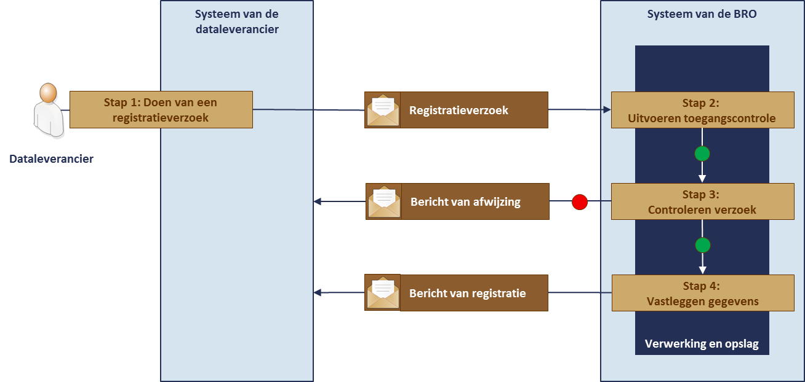

# Innameproces

## Levenscyclus registratieobject

*Hier tekst en plaatje toevoegen die de levensloop van registratieobjecten uitlegt*

## Innameverzoek
De dataleverancier biedt gegevens aan met het doel de gegevens op te laten nemen in de registratie ondergrond. Het proces van inname begint aan de kant van de dataleverancier met een verzoek. Vervolgens beoordeelt de basisregistratie ondergrond dat verzoek om, als alles goed is, de gegevens in het systeem op te nemen. Gaat er iets onverhoopt fout, dan wijst de basisregistratie ondergrond het verzoek af. In alle gevallen krijgt de dataleverancier een antwoord op het verzoek terug. 

De basisregistratie ondergrond handelt de verzoeken altijd per object af. Dat wil zeggen één registratieobject tegelijk, in dit geval dus één grondwatermonitoringput. Het begrip innameverzoek heeft in de context van de basisregistratie ondergrond altijd betrekking op één registratieobject.

De gegevens die onderwerp zijn van een innameverzoek, vormen één geheel en dat wordt in de taal van de basisregistratie ondergrond een *brondocument* genoemd. Een brondocument bevat de gegevens die de dataleverancier van een bepaald object overdraagt aan de basisregistratie ondergrond. 

Er bestaan twee categorieën innameverzoeken. Het hangt er namelijk vanaf wat de dataleverancier precies beoogt. 
Wil een leverancier nieuwe gegevens aan de BRO overdragen die net beschikbaar zijn gekomen, of wil hij fouten verbeteren in de gegevens die al aanwezig zijn. In de basisregistratie ondergrond spreekt men van registratieverzoeken, resp. correctieverzoeken. 
De verwerking van registratieverzoeken verloopt anders dan van correctieverzoeken. 

Via een innameverzoek kan een dataleverancier niet alle gegevens van een registratieobject laten verwijderen. Verwijderen, of beter het uit registratie nemen van een object is een ingrijpende verandering in de registratie ondergrond, en daartoe kan pas worden besloten na zorgvuldig onderzoek. Het onderzoek begint bij de registratiebeheerder en uiteindelijk kan een object alleen na akkoord van de bronhouder uit registratie genomen worden. Het is bovendien goed om te weten dat de gegevens niet uit de registratie verwijderd worden. De gegevens blijven bestaan maar zijn niet langer voor gebruikers toegankelijk.

## Verwerking van een registratieverzoek
De verwerking van een registratieverzoek verloopt geheel automatisch en volgens een vaste opeenvolging van stappen. Dit is waar het in het kort op neerkomt:

1. De dataleverancier stuurt vanuit zijn systeem een registratieverzoek met daarin een brondocument.
2. Het systeem van de BRO voert een toegangscontrole uit.
3. Wanneer toegang tot het systeem van de BRO is verkregen, begint de controle van het verzoek en wordt onder meer vastgesteld of het verzoek inhoudelijk aan de gestelde eisen voldoet. 
O	Wanneer de inhoudelijke controle fouten oplevert, wordt het verzoek afgewezen en ontvangt het systeem van de dataleverancier een bericht van afwijzing.
4. Wanneer de inhoudelijke controle geen fouten oplevert en er geen technische problemen zijn, wordt het registratieverzoek door het systeem van de BRO geaccepteerd. De aangeboden gegevens worden met de gegevens die de BRO zelf genereert vastgelegd. Het BRO-systeem stuurt het systeem van de dataleverancier als antwoord het bericht dat diens registratieverzoek is verwerkt.

De stappen en de bijbehorende berichten worden in het onderstaande plaatje uitgebeeld. 

Het resultaat van de verwerking is dat het brondocument in het *register brondocumenten ondergrond* is opgenomen, dat de gegevens eruit zijn gehaald en vastgelegd zijn in de *registratie ondergrond*. De gegevens zijn dan voor eenieder beschikbaar.

Het verzoek van de dataleverancier en het antwoord dat de BRO daarop normaliter geeft worden berichten genoemd. In het geval zich technische problemen voordoen wordt het antwoord een *melding* genoemd.

## Verwerking van een correctieverzoek
De verwerking van een correctieverzoek verloopt iets anders dan dat van een registratieverzoek. De eerste stappen in de verwerking zijn hetzelfde, maar nadat het BRO-systeem heeft gecontroleerd of alles goed is, neemt de registratiebeheerder de controle over. 
Dit is waar het in het kort op neerkomt:

1. De dataleverancier stuurt vanuit zijn systeem een correctieverzoek met daarin een brondocument.
2. Het systeem van de BRO voert een toegangscontrole uit.
3. Wanneer toegang tot het systeem van de BRO is verkregen, begint de controle van het verzoek en wordt onder meer vastgesteld of het verzoek inhoudelijk aan de gestelde eisen voldoet. 
o	Wanneer de inhoudelijke controle fouten oplevert, wordt het verzoek afgewezen en ontvangt het systeem van de dataleverancier een bericht van afwijzing.
4. Wanneer de inhoudelijke controle geen fouten oplevert en er geen technische problemen zijn, wordt het correctieverzoek door het systeem van de BRO geaccepteerd. Vervolgens neemt de registratiebeheerder de verwerking over. Hij beoordeelt de reden van het correctieverzoek en de gevolgen die het heeft voor de informatie in de registratie ondergrond .
o	Indien zijn beoordeling aangeeft dat er iets fout gaat, ontvangt de dataleverancier een e-mail waarin de registratiebeheerder toelicht waarom hij het verzoek heeft moeten afwijzen.
5. Wanneer de registratiebeheerder geen problemen ziet, wordt het verzoek doorgeleid. De aangeboden gegevens worden, met de gegevens die de BRO zelf genereert, vastgelegd. Het BRO-systeem stuurt de dataleverancier per e-mail bericht dat het correctieverzoek is verwerkt.

Het resultaat van de verwerking is dat het brondocument in het register brondocumenten ondergrond is opgenomen, dat de gegevens eruit zijn gehaald en dat de onjuiste gegevens in de registratie ondergrond zijn verbeterd. De gegevens zijn dan voor eenieder beschikbaar.

De stappen en de bijbehorende berichten worden in onderstaande figuur uitgebeeld. 

## Verwerking van een beëindigingsverzoek

## Conversie registratie-object met voorgeschiedenis
