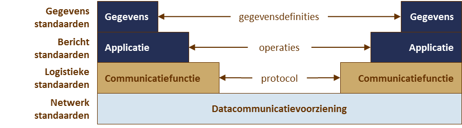
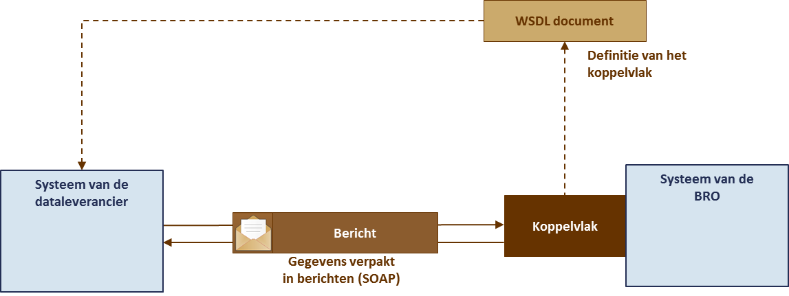
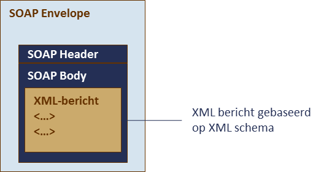

# Uitgangspunten

## Authenticatie en autorisatie
Een organisatie kan niet zomaar gegevens aan de BRO aanbieden. Een organisatie moet zich eerst als *dataleverancier* bij de registerbeheerder hebben laten registreren. De registratie is gekoppeld aan een bepaald type *registratieobject*. Om gegevens over een grondwatermonitoringput aan te mogen bieden moet een organisatie zich als dataleverancier van het type registratieobject 'Grondwatermonitoringput' laten registreren.

Wanneer een bronhouder zelf gegevens wil aanbieden, is er sprake van een bilaterale overeenkomst en kan de bronhouder zich direct als dataleverancier laten registreren. Wanneer een intermediaire partij namens een bronhouder gegevens wil aanleveren, is sprake van een overeenkomst tussen drie partijen.

De gegevens van de grondwatermonitoringput worden altijd via de innamewebservice aangeboden. De dataleverancier die de innamewebservice wil gebruiken moet over software beschikken die de webservice kan aanroepen. Met de eigen software heeft hij dan direct toegang tot het systeem van de basisregistratie ondergrond, het BRO-systeem, en kan hij snel en op betrouwbare wijze gegevens aanbieden.
Om zich bij de registerbeheerder als gebruiker van de webservice te laten registreren, moet de organisatie van de dataleverancier beschikken over een PKIoverheid services certificaat.

## Berichten en meldingen

## Communicatiestandaarden en uitwisselformaat
De communicatie tussen het systeem van de dataleverancier en het BRO-systeem verloopt over een aantal lagen. In de volgende afbeelding is per laag aangegeven welke communicatiestandaard van toepassing is.

De keuzes van de communicatiestandaarden die zijn gebruikt bij de inrichting van het BRO-systeem zijn gebaseerd op de NORA (Nederlandse Overheid Referentie Architectuur en de Digikoppeling specificaties. 
### Gegevens- en berichtenstandaarden
Omdat alle registratieobjecten van de BRO een relatie hebben met een locatie op het aardoppervlak, zijn de gegevens en berichten volgens de NEN3610 standaard gemodelleerd.

De gegevens die via de innamewebservice aan de BRO worden overgedragen staan in het IMBRO-XML formaat. Het IMBRO-XML formaat is de gegevensdefinitie omgezet naar de technische taal die voor de uitwisseling van gegevens met het systeem van de BRO gebruikt wordt. De technische uitwerking wordt toegelicht in de koppelvlakbeschrijving van de innamewebservice.

### Logistieke standaard
Als logistieke standaard is voor de BRO het 2W-be profiel van Digikoppeling ([2]) gehanteerd. Het koppelvlak is daarom gerealiseerd als een WUS-webservice waarvoor een aantal onderliggende standaarden zijn voorgeschreven, waaronder WSDL 1.0 en SOAP 1.1. In onderstaande afbeelding is dat schematisch weergegeven.

Het WSDL-document (Web Service Definition Language) beschrijft in technische termen de volledige API (Application Programming Interface) van de GMW innamewebservice (zie hoofdstuk 3). Het beschrijft de operaties, inclusief request en response, maar ook het protocol (in dit geval SOAP) waarmee request en response worden uitgewisseld en de URL waarop de webservice benaderd kan worden.

SOAP (Simple Object Access Protocol) is een protocol voor het versturen van berichten. Een SOAP bericht bestaat uit een Envelope met daarin de Header en de Body. De Body bevat het eigenlijke XML-bericht dat uitgewisseld wordt. Ieder XML-bericht dat als onderdeel van een SOAP-bericht met het BRO-systeem uitgewisseld wordt, is beschreven in een aantal BRO XML-schema’s (XSD). Deze structuur van een SOAP-bericht is in de volgende afbeelding samengevat.

De XML-schema’s (XSD) volgen de gegevensdefinities van de catalogus nauwkeurig, maar soms leidt de toepassing van de NEN3610 standaard tot afwijkingen. Daar waar wordt afgeweken van de catalogus wordt dat expliciet toegelicht. Omdat de XSD is uitgewerkt in het Engels en de catalogus in het Nederlands is beschreven, is in bijlage A een vertaling van de berichtgegevens opgenomen.
### Netwerkstandaard
Als netwerkstandaard wordt TCP/IP over het internet gehanteerd.
