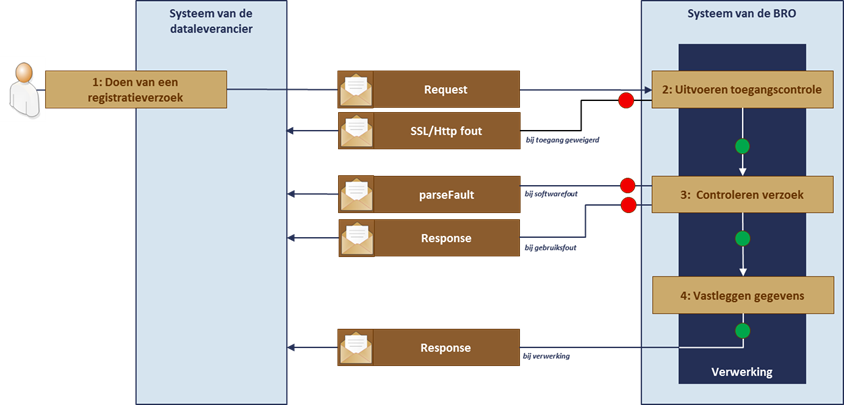
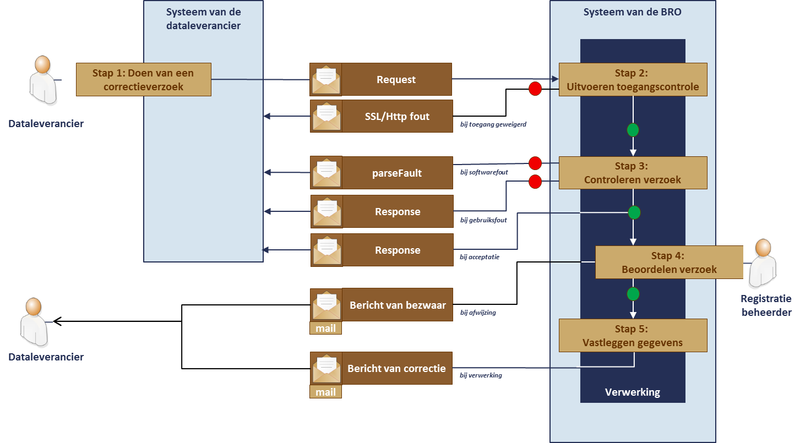
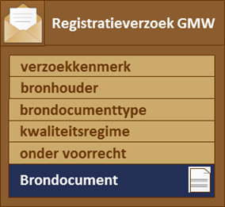
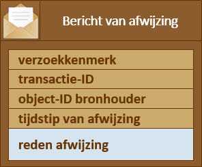
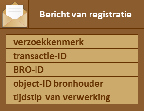
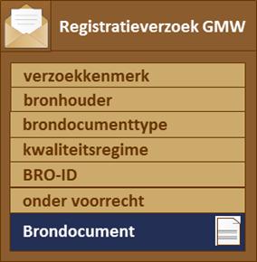
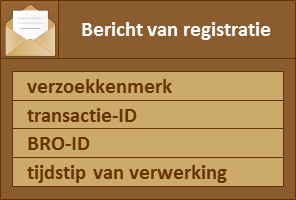

# Proces inname van gegevens

Dit hoofdstuk geeft een functionele beschrijving van het automatisch innemen van gegevens en het bijhorende koppelvlak. Hierbij staan de twee functionaliteiten van de GMW innamewebservice centraal: 
1. functionaliteit voor het **registreren** van gegevens;
2. functionaliteit voor het **corrigeren** van gegevens.

Elke van deze functionaliteiten heeft een aantal *operaties*.

De volgende paragrafen beschrijven:
* de data-operaties die kunnen plaatsvinden bij het registreren en corrigeren van een registratieobject;
* het verwerking van berichten voor registratie;
* het verwerking van berichten voor correctie;
* inname verzoeken en bijhorende request- en response-berichten in de API;
* de inhoud van de requests/responses.

## Operaties bij een registratieverzoek
De innamewebservice voor het registratieobject Grondwatermonitoringput biedt de dataleverancier basale functionaliteit. De API van de BRO GMW innamewebservice definieert hiervoor vijf operaties:
1. Register
2. Replace
3. Insert
4. Move
5. Delete

Elke operatie heeft een eigen request en response die de verschillende verzoeken en antwoorden realiseren. Deze worden in de volgende paragrafen beschreven.
### Register
De aard van een grondwatermonitoringput brengt met zich mee dat er drie soorten gegevensinname kunnen worden onderscheiden in de bestaansgeschiedenis van een put:
* Registratie starten   
Nadat de constructie van een put is voltooid, kan de registratie van de put worden gestart. De initiële inrichting van de put wordt geregistreerd in de BRO.
* Registratie aanvullen  
Nadat een put is geconstrueerd, breekt de gebruiksperiode aan. Als in de werkelijkheid  een verandering aan de put optreedt, nadat de put in de BRO is geregistreerd, dan moeten de putgegevens in de BRO worden aangevuld met de nieuwe informatie. Daarbij wordt over de putgegevens *materiële geschiedenis* (zie de catalogus) opgebouwd. Afhankelijk van de gebeurtenis wordt in het request van de register-operatie een bepaald brondocument opgenomen, met daarin de nieuwe gegevens.
* Registratie beëindigen   
Na de gebruiksperiode van de put kan deze worden opgeruimd. Dit wordt in de BRO geregistreerd en de put krijgt in de BRO de status voltooid. De geregistreerde putgegevens kunnen daarna niet meer worden aangevuld. 

De putgegevens kunnen naar aanleiding van ieder van deze drie gebeurtenissen worden aangeboden met een register operatie. Het brondocument in het request geeft aan welke gebeurtenis er is opgetreden.

### Replace
Met deze operatie wordt een eerdere registratie of aanvulling gecorrigeerd door de desbetreffende gegevens te vervangen door de gegevens in het request.

De correctie van het type 'Replace' is een correctie die **niet** ingrijpt in de materiële geschiedenis van een put. Alle gebeurtenissen zijn netjes in volgorde en met de juiste datum geregistreerd. Maar bij een van de transacties zijn een of meer onjuiste waarden aangeleverd, of zijn niet alle nieuwe gegevens aangeleverd.

In het eerste geval dient de dataleverancier een verzoek in om die onjuiste waarde(n) te vervangen, en dat is ook letterlijk wat er in de registratie ondergrond gebeurt: iedere waarde wordt vervangen. In het tweede geval dient de dataleverancier een verzoek in waarin uitsluitend de ontbrekende gegevens zijn opgenomen. In beide gevallen wordt er geen materiële geschiedenis maar uitsluitend formele geschiedenis opgebouwd.

### Insert
Met deze operatie wordt een ontbrekende aanvulling ingevoegd in de tijdlijn van de putgeschiedenis.

De correctie van het type invoegen is een correctie die **wel** ingrijpt in de materiële geschiedenis van een put. Het gaat om de eenvoudigste en meest voorkomende variant. Namelijk het geval dat de dataleverancier de registratie had moeten aanvullen, maar dat vergeten was terwijl hij intussen wel een andere verandering heeft laten registreren.

Om de fout te herstellen, dient de dataleverancier een verzoek in met het doel de ontbrekende gegevens in te voegen in de tijdlijn met geregistreerde gegevens. De vergeten gebeurtenis wordt opgenomen in de putgeschiedenis, de betreffende gegevens krijgen een nieuwe waarde met een begin geldigheid (zie innamehandboek) en iedere reeds geregistreerde waarde die vanwege de gebeurtenis verandert krijgt een datum einde geldigheid.

### Move
Met deze operatie wordt een eerdere registratie of aanvulling verplaatst in de tijdlijn van de putgeschiedenis.

De correctie van het type verplaatsen is een correctie die **wel** ingrijpt in de materiële geschiedenis van een put. Het gaat om een complexe variant, waarbij een gebeurtenis is geregistreerd met een foute waarde voor de datum waarop de gebeurtenis heeft plaatsgevonden.

Om de fout te herstellen, levert de dataleverancier de gegevens uit de eerdere registratie of aanvulling opnieuw aan in een move operatie, nu met het correcte moment waarop de gebeurtenis heeft plaats gevonden. De gebeurtenis wordt opgezocht in de putgeschiedenis en verplaatst naar de juiste plek in de tijdlijn van de putgeschiedenis. Van de betreffende gegevens (rondom de oude plek in de tijdlijn en de gecorrigeerde plek in de tijdlijn) worden de waarden voor begin geldigheid (zie innamehandboek) en einde geldigheid aangepast, afhankelijk van het feit of een gegeven voor of na de verwerking van de move operatie vanwege de verplaatste gebeurtenis van waarde is veranderd of juist niet meer.

### Delete
Met deze operatie wordt een eerdere aanvulling verwijderd uit de tijdlijn van de putgeschiedenis.

De correctie van het type verwijderen is een correctie die **wel** ingrijpt in de materiële geschiedenis van een put. Het gaat om een eenvoudige variant, waarbij een aanvulling ten onrechte is aangeboden.

Om de fout te herstellen, dient de dataleverancier een verzoek in met het doel de betreffende gegevens te verwijderen uit de tijdlijn. De gebeurtenis wordt opgezocht in de putgeschiedenis en verwijderd uit de tijdlijn van de putgeschiedenis. Van de betreffende gegevens (rondom de verwijderde plek in de tijdlijn) worden de waarden voor begin geldigheid (zie innamehandboek) en einde geldigheid aangepast, afhankelijk van het feit of een gegeven voor of na de verwerking van de delete operatie vanwege de verwijderde gebeurtenis van waarde is veranderd of juist niet meer. 

## Verwerking van een registratieverzoek
De verwerking van een registratieverzoek verloopt geheel automatisch en volgens een vaste opeenvolging van stappen. Dit is waar het in het kort op neerkomt:

1. De dataleverancier stuurt vanuit zijn systeem een registratieverzoek met daarin een brondocument. Hiervoor wordt de *register* operatie van de GMW innamewebservice gebruikt met het *registrationRequest* als parameter.
2. Het systeem van de BRO voert een toegangscontrole uit.
3. Wanneer toegang tot het systeem van de BRO is verkregen wordt onder meer vastgesteld of het verzoek inhoudelijk en technisch aan de gestelde eisen voldoet. De technische controle vindt plaats door het *request* te valideren op basis van een zogeheten XSD-bestand. Als hierbij fouten gevonden worden, dan worden deze beschouwd als een technische fout van het systeem van de dataleverancier en teruggegeven als een *parseFault*. De inhoudelijke controle vindt plaats door het *request8 te controleren volgens de regels die zijn gedefinieerd in de catalogus of bijlage XXX?? (business rules). Deze regels zijn niet in de XSD vastgelegd, maar worden gecontroleerd door de programmatuur van het BRO-systeem. Voorbeelden van controles zijn: 
* Is een waarde niet groter dan de toegestane maximale waarde?
* Voldoet een waarde aan de toegestane waardes voor een gegeven?
Als hierbij fouten worden gevonden, dan worden deze beschouwd als een gebruiksfout en teruggegeven in een *bericht van afwijzing* (response).

4. Als alle controles succesvol zijn verlopen dan legt het BRO-systeem de aangeboden gegevens vast en wordt het resultaat teruggegeven als een *bericht van registratie* (response).

Het resultaat van de verwerking is dat het brondocument in het register brondocumenten ondergrond is opgenomen, dat de gegevens eruit zijn gehaald en vastgelegd zijn in de *basisregistratie ondergrond*. 
Het verzoek van de dataleverancier en het antwoord dat de BRO daarop normaliter geeft worden berichten genoemd. In het geval zich technische problemen voordoen wordt het antwoord een melding genoemd.

## Verwerking van een correctieverzoek
De verwerking van een correctieverzoek verloopt iets anders dan dat van een registratieverzoek. De eerste stappen in de verwerking zijn hetzelfde, maar nadat het BRO-systeem heeft gecontroleerd of alles goed is, neemt de registratiebeheerder de controle over. 
Dit is waar het in het kort op neerkomt:

1.	Het initiatief om een operatie te beginnen ligt bij het systeem van de dataleverancier.   Dat roept de register operatie van de *GMW innamewebservice* aan met het *registrationRequest* als parameter.
2.	Uitvoeren toegangscontrole.   Dit bestaat uit identificatie, authenticatie, versleuteling en autorisatie. 
3.	Wanneer toegang tot het systeem van de BRO is verkregen, begint de controle van het verzoek en wordt onder meer vastgesteld of het verzoek inhoudelijk aan de gestelde eisen voldoet. Wanneer de inhoudelijke controle fouten oplevert, wordt het verzoek afgewezen en ontvangt het systeem van de dataleverancier een bericht van afwijzing.
4.	Wanneer de inhoudelijke controle geen fouten oplevert en er geen technische problemen zijn, wordt het correctieverzoek door het systeem van de BRO geaccepteerd. Vervolgens neemt de registratiebeheerder de verwerking over. Hij beoordeelt de reden van het correctieverzoek en de gevolgen die het heeft voor de informatie in de registratie ondergrond. Indien zijn beoordeling aangeeft dat er iets fout gaat, ontvangt de dataleverancier een e-mail waarin de registratiebeheerder toelicht waarom hij het verzoek heeft moeten afwijzen.
5.	Wanneer de registratiebeheerder geen problemen ziet, wordt het verzoek doorgeleid. De aangeboden gegevens worden, met de gegevens die de BRO zelf genereert, vastgelegd. Het BRO-systeem stuurt de dataleverancier per e-mail bericht dat het correctieverzoek is verwerkt.

Het resultaat van de verwerking is dat het brondocument in het register brondocumenten ondergrond is opgenomen, dat de gegevens eruit zijn gehaald en dat de onjuiste gegevens in de registratie ondergrond zijn verbeterd. De gegevens zijn dan voor eenieder beschikbaar.

## Registreren van gegevens
### Registreren en de levenscyclus van een object
De registratiefunctionaliteit ken de volgende varianten, die elke een fase in de levenscyclus van een registratieobject markeert:
* registratie starten
* registratie aanvullen
* registratie beëindigen

### Registratie starten
Zodra de constructie van de put voltooid is en alle gegevens door of voor de bronhouder zijn vastgelegd, kan het registreren van gegevens beginnen. Dat gebeurt via een **registratieverzoek**.

De dataleverancier biedt dan een brondocument aan met de naam *GMW-Inrichten*. 
Het *brondocument* is belangrijkste onderdeel van het registratieverzoek. Het bevat alle gegevens die het object Grondwatermonitoringput beschrijven op het moment dat de constructie volledig is ingericht.
Met het brondocument moet de dataleverancier in zijn verzoek aangeven 
* aan welk *kwaliteitsregime* het brondocument voldoet;
* of hij het verzoek onder voorrecht doet omdat het om een put met voorgeschiedenis gaat;
* voor welke bronhouder hij de gegevens aanbiedt. Dat laatste hoeft de dataleverancier alleen op te geven als hij zelf niet de bronhouder van de gegevens is.
* een identificatie: het verzoekkenmerk. Dat verzoekkenmerk is nodig in de communicatie, bijvoorbeeld als er iets mis is gegaan en de dataleverancier daarover contact wil zoeken met de servicedesk.

In de verwerking van het verzoek zijn allerlei controles ingebouwd. Als er in technische zin iets mis gaat, krijgt de dataleverancier geen bericht van afwijzing maar een melding.
 
Een **bericht van afwijzing** krijgt de dataleverancier als antwoord, wanneer bij de verwerking een fout wordt gevonden die het gevolg is van een invoerfout.

Bij het invoeren van de gegevens die met het brondocument worden meegegeven kan een fout worden gemaakt, maar de in potentie grootste bron van fouten is het brondocument zelf. 
Het belangrijkste onderdeel van het bericht van afwijzing is de reden afwijzing. Wanneer de reden van afwijzen in het brondocument ligt, wordt van iedere fout vermeld: 
* bij welk gegeven de fout is geconstateerd,
* soms ook wat de waarde van het gegeven is,
* en wat de fout is. 
Het bericht bevat verder het tijdstip van afwijzing en het verzoekkenmerk van de dataleverancier, de eigen identificatie van het object die in het brondocument is opgenomen (object-ID bronhouder) en het unieke kenmerk dat de BRO zelf toekent (transactie-ID).

Wanneer de verwerking van het verzoek foutloos is verlopen, krijgt de dataleverancier als antwoord een **bericht van registratie**.

Het belangrijkste gegeven in het bericht van registratie is het BRO-ID, de identificatie van het object in de BRO die voortaan in het formele berichtenverkeer moet worden gebruikt. De dataleverancier krijgt ook terug op welk moment het object is geregistreerd. 
Het bericht van registratie bevat verder, net als het bericht van afwijzing, het verzoekkenmerk van de dataleverancier, het unieke kenmerk dat de BRO zelf toekent en de eigen identificatie van het object.

Het belangrijkste resultaat van de verwerking is dat de grondwatermonitoringput als object in de registratie ondergrond is opgenomen. Het object krijgt als registratiestatus geregistreerd.

### Registratie aanvullen
Wanneer, na registratie van het brondocument GMW-Inrichten, er in de werkelijkheid een *gebeurtenis* optreedt waarvan de gevolgen geregistreerd moeten worden, wordt een **registratieverzoek** aangeboden met een brondocument dat de nieuwe gegevens bevat.

Het registratieverzoek lijkt sterk op het verzoek dat bij het begin van de registratie wordt aangeboden. De verschillen zijn dat de dataleverancier altijd het BRO-ID meegeeft van het object waarvoor hij nieuwe gegevens aanbiedt bevat en een ander type brondocument.

De aard van de gebeurtenis die in de werkelijkheid optreedt, kan verschillen. Er zijn elf typen gebeurtenissen onderkend en bij iedere daarvan hoort een apart type brondocument (zie onderstaande tabel). 
Eenzelfde type gebeurtenis kan meer dan eens optreden en een verzoek tot aanvullen kan dan ook zo vaak als nodig worden aangeboden.

| Gebeurtenis |	Brondocument |
| ----------- | ------------ |
|De put is voorzien van een beschermconstructie of een al bestaande beschermconstructie is vervangen door een ander type | GMW-Beschermconstructie|
|Van één of meer buizen is de toestand die aangeeft of zij gebruikt kan worden voor monitoring veranderd |	GMW-Buisstatus |
|Het eigendom van de grondwatermonitoringput is op een andere organisatie overgegaan |	GMW-Eigenaar |
|Van één of meer elektrodes is toestand die aangeeft of zij gebruikt kan worden voor monitoring veranderd |	GMW-Elektrodestatus |
|Een of meer monitoringbuizen zijn korter gemaakt en dat kan gedaan zijn in combinatie met het aanbrengen of vervangen van een beschermconstructie | GMW-Inkorten |
|Er is een nieuw stijgbuisdeel in een bestaande monitoringbuis geplaatst | GMW-Inplaatsen |
|De positie van het maaiveld is opnieuw vastgesteld | GMW-Maaiveld |
|Het uitvoeren van het onderhoud van de grondwatermonitoringput is op een andere partij overgegaan | GMW-Onderhouder |
|Een of meer monitoringbuizen zijn langer gemaakt en dat kan gedaan zijn in combinatie met het aanbrengen of vervangen van een beschermconstructie | GMW-Oplengen |
|De positie van het maaiveld en van de bovenkant van de buizen is opnieuw vastgesteld | GMW-Posities |
|De positie van het maaiveld is opnieuw vastgesteld omdat het terrein rond de put is opgehoogd of afgegraven | GMW-Verleggen |

Het **bericht van afwijzing** dat de dataleverancier als antwoord krijgt wanneer bij de verwerking een invoerfout in het verzoek wordt gevonden verschilt maar op een punt van dat wat teruggegeven wordt bij het begin van de registratie. Het verschil is dat het BRO-ID wordt teruggegeven in plaats van het object-ID bronhouder. 

De verwerking van het verzoek verloopt anders dan bij het starten van de registratie in de zin dat er extra controles zijn ingebouwd. Die controles zijn nodig omdat bij aanvulling beoordeeld moet worden of de gegevens passen bij wat al van de put geregistreerd is. Dat betekent vooral dat bepaalde waarden vergeleken moeten worden met al geregistreerde waarden. Enkele voorbeelden moeten dat verduidelijken. Als de gebeurtenis inhoudt dat een bestaand gegeven een andere waarde moet krijgen, dan moet de aangeboden waarde ook werkelijk anders zijn: een nieuwe eigenaar is een andere eigenaar dan al geregistreerd is. Een ander voorbeeld is dat de gebeurtenis ook moet passen in de tijdreeks die al in de registratie ondergrond is opgebouwd. Gebeurtenissen moeten netjes in volgorde worden aangeleverd. De registratie kan niet meer aangevuld worden als de put is opgeruimd. Ten slotte moet ook in de registratie ondergrond gekeken worden of dataleverancier als de leverancier van het betreffende object is geregistreerd. De reden van afwijzing moet zo duidelijk verwoord zijn dat de dataleverancier begrijpt wat er precies is fout gegaan.

Wanneer de verwerking van het verzoek foutloos is verlopen, krijgt de dataleverancier weer als antwoord een **bericht van registratie**. 

Het enige verschil met het antwoord dat hij helemaal aan het begin van de registratie krijgt, is dat het object-ID bronhouder ontbreekt omdat het niet meer gebruikt wordt in de communicatie. 

Het belangrijkste resultaat van de verwerking is dat de gebeurtenis met de bijbehorende gegevens in de registratie ondergrond is vastgelegd. De gebeurtenis wordt als zodanig geregistreerd, daarbij krijgen een of meer attributen een nieuwe waarde. Die waarde is geldig vanaf de datum van de gebeurtenis (datum begin geldigheid). De eerder geregistreerde waarde blijft behouden, maar verliest op de datum van de gebeurtenis zijn geldigheid (datum einde geldigheid). 
Na verwerking van het eerste vervolgverzoek krijgt het object de registratiestatus aangevuld.

### Registratie beëindigen
Wanneer de put is opgeruimd, kan de registratie van het object beëindigd worden. Het beëindigen van de registratie is eenmalig en het bijbehorende brondocument heet *GMW-Opruimen*. Dat document vertelt eigenlijk alleen wanneer de put is opgeruimd. In de verwerking zijn soortgelijke controles ingebouwd als bij aanvullen en de berichten hebben dezelfde opbouw. 

Wanneer de verwerking van het verzoek foutloos is verlopen, krijgt het object als registratiestatus *voltooid*, en als gebeurtenis wordt geregistreerd dat de put is opgeruimd. Vanaf dat moment kunnen er geen nieuwe gegevens meer worden geregistreerd.

## Berichten bij registratie starten
Bij een *register* operatie zijn drie berichten van toepassing: een registratieverzoek, een bericht van afwijzing en een bericht van registratie. Deze paragraaf beschrijft de inhoud van deze berichten bij een ‘registratie starten’ gebeurtenis.

### Request: registratieverzoek
Onderstaande figuur geeft de mapping weer van het registratieverzoek in het innamehandboek op het datatype *RegistrationRequest* in dit document (zie paragraaf 6.1), zoals gebruikt door de operatie *register* (zie hoofdstuk 5).

![RequestRegistratieStarten] (media/BrtReqRegistratieStarten.png)

Het element brondocumenttype in het registratieverzoek komt niet voor in het *RegistrationRequest*, omdat dit gegeven impliciet bekend is, gegeven de inhoud van het element *sourceDocument*.

Het element *sourceDocument* bevat alle gegevens die in de catalogus voor het registratieobject Grondwatermonitoringput zijn gespecificeerd, met uitzondering van de gegevens die door het BRO-systeem worden gegenereerd of afgeleid uit het RegistrationRequest.

### Response: bericht van afwijzing
Het innamehandboek benoemt als mogelijke reactie op een registratieverzoek een bericht van afwijzing. De webservice gebruikt hiervoor een *response* van het datatype *IntakeResponse*.

![ResponseregistratieAfwijzen] (BrtRespRegistratieStartAfwijzing.png)

Het handboek definieert een aantal berichten als antwoord op een innameverzoek. In de SOAP webservice definities mag elk *request* slechts één *response* hebben. Daarom is het element *responseType* toegevoegd, om de betekenis van de response te duiden. In dit geval heeft het element responseType de vaste waarde rejection.

De waarde van de elementen requestReference en objectIdAccountableParty wordt overgenomen uit het request c.q. het sourceDocument in het request. De waarde van de overige elementen wordt toegekend door de webservice. Het element rejectionReason bevat een waarde uit de tabel met gebruiksfouten; zie het innamehandboek.

Als deze response wordt gegeven omdat er een of meer gebruiksfouten in het sourceDocument zijn geconstateerd, dan is de waarde van rejectionReason “er zijn 1 of meer fouten geconstateerd in het brondocument” en volgen er na dit element een of meer sourceDocumentErrors. 

