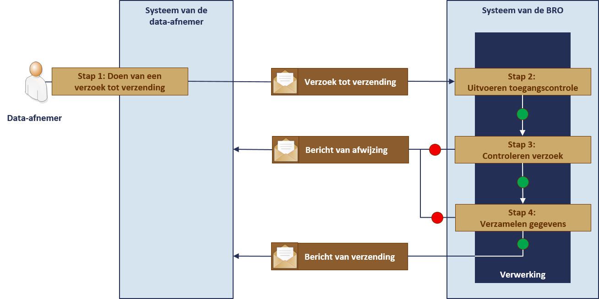

# Uitgifte proces
Opvragen van gegevens via de uitgiftewebservice verloopt heel anders dan via het loket. De gebruiker die via de webservice gegevens opvraagt krijgt de gegevens onmiddellijk geleverd. Maar om de webservice te kunnen gebruiken moet hij wel over software beschikken die de webservice kan aanroepen en moet hij zich als data-afnemer bij de BRO laten registreren. De eis die daarbij wordt gesteld is dat de organisatie waar hij werkt beschikt over een PKIoverheid services certificaat. Dat certificaat is een soort digitaal paspoort, het legitimatiebewijs van het softwaresysteem van de gebruiker. 

Opvragen van gegevens via de uitgiftewebservice is snel, betrouwbaar en elementair. Dat laatste betekent in de eerste plaats dat er voor ieder type registratieobject een aparte webservice is. Wil men gegevens van meer dan een type opvragen, dan moet men verschillende webservices gebruiken. Verder heeft de gebruiker beperkte keuzevrijheid. Hij kan of alle gegevens van een enkel registratieobject opvragen of een beperkte selectie van gegevens van een aantal registratieobjecten tegelijk. De reden daarachter is dat een webservice alleen in algemene gebruikerswensen voorziet. De eigen software van de data-afnemer moet zo zijn ingericht dat de webservice wordt aangeroepen op een manier die aansluit op   de eigen bedrijfsprocessen.

Het proces van uitgifte is bij het gebruik van de webservice strikt geformaliseerd. De webservice verzorgt de communicatie tussen twee softwaresystemen en om te borgen dat de verwerking van een verzoek automatisch kan verlopen zijn er allerlei controles ingebouwd. Een ander verschil is dat men de gegevens altijd in het IMBRO-XML formaat krijgt. 

## Opties bij opvragen via webservice
De uitgiftewebservice voorziet in elementaire functionaliteit en die dekt drie gebruikscasussen. De eerste is het geval waarin een gebruiker aanvankelijk niet precies weet welke objecten hij wil hebben en daarom op zoek gaat naar de objecten die aan bepaalde kenmerken voldoen. 
De tweede casus is het geval waarin de gebruiker weet welke objecten aan zijn kenmerken voldoen en hij alleen de actuele gegevens van een object wil opvragen. Actueel wil zeggen de gegevens met de waarde die op het moment van opvragen geldt. De grondwatermonitoringput is namelijk een registratieobject met een materiële geschiedenis en dat betekent dat de waarde van bepaalde gegevens in de loop van de tijd kan wijzigen. 
De derde casus is het geval waarin de gebruiker weet welke objecten aan zijn kenmerken voldoen en hij zowel de actuele als de historische waarden van de gegevens van een object wil opvragen.

De drie opties zijn vertaald in twee verzoeken:
1. Een verzoek tot verzending van de kengegevens van een aantal grondwatermonitoringputten.
De data-afnemer geeft in zijn verzoek de verzameling kenmerken mee waaraan de grondwatermonitoringputten die hij zoekt moeten voldoen. In antwoord daarop krijgt hij van ieder van de objecten die aan de kenmerken voldoen de gegevens geleverd die het object karakteriseren, met ter identificatie het BRO-ID. 
2. Een verzoek tot verzending van de gegevens van een bepaalde grondwatermonitoringput.
De data-afnemer geeft in zijn verzoek het BRO-ID van het grondwatermonitoringput die hij wil hebben mee en specificeert of hij alleen de actuele gegevens of de actuele en de historische gegevens wil hebben.  In antwoord daarop krijgt hij de gevraagde gegevens van de put geleverd.

In de volgende paragrafen wordt de verwerking in meer detail beschreven.

## Opvragen kengegevens
Het opvragen van kengegevens verloopt volgens een vaste opeenvolging van stappen.
Dit is waar het in het kort op neerkomt:

1. De data-afnemer stuurt vanuit zijn systeem een verzoek tot verzending van kengegevens. Daarbij geeft hij de kenmerken mee van de grondwatermonitoringputten waarvan hij gegevens wil krijgen.
2. Het systeem van de BRO voert een toegangscontrole uit.
3. Wanneer toegang tot het systeem van de BRO is verkregen, begint de controle van het verzoek en wordt onder meer vastgesteld of het verzoek inhoudelijk aan de gestelde eisen voldoet. 
O	Wanneer de inhoudelijke controle fouten oplevert, wordt het verzoek afgewezen en ontvangt het systeem van de data-afnemer een bericht van afwijzing.
4. Wanneer de inhoudelijke controle geen fouten oplevert en er ook geen technische problemen zijn, verzamelt het systeem van de BRO de kengegevens van de grondwatermonitoringputten die aan de meegegeven kenmerken voldoen. 
*Wanneer de verzameling gegevens te groot is, wijst het BRO-systeem het verzoek tot verzending alsnog af en ontvangt het systeem van de data-afnemer een bericht van afwijzing.
*Wanneer de verzameling onder het gestelde maximum ligt stuurt het BRO-systeem de data-afnemer de opgevraagde gegevens in een bericht van verzending. 

Het verzoek van de data-afnemer en het antwoord dat de BRO daarop normaliter geeft worden berichten genoemd. In het geval zich technische problemen voordoen, wordt het antwoord een melding genoemd. 

De stappen en de bijbehorende berichten worden in het onderstaande plaatje uitgebeeld.

## Opvragen gegevens
Het opvragen van de gegevens van een grondwatermonitoringput verloopt iets anders dan het opvragen van kengegevens.

![OpvragenGegevens] (media\)

De berichten die worden uitgewisseld zijn alleen qua inhoud anders dan berichten bij een verzoek tot levering van kengegevens. Een bijzonderheid is dat bronhouders en data-afnemers iets meer gegevens geleverd krijgen dan andere afnemers.
