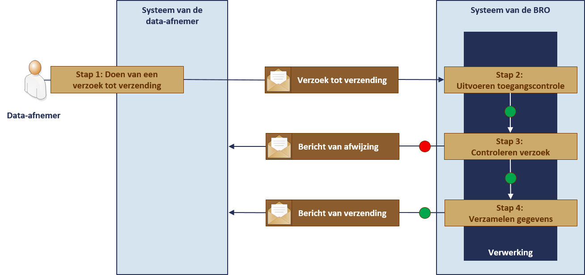
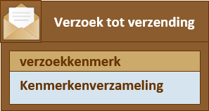
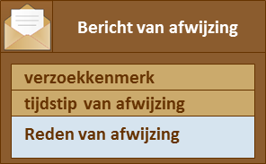
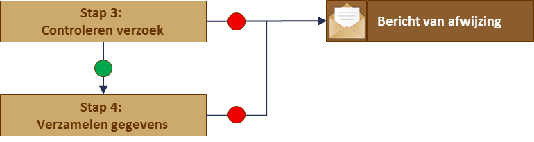
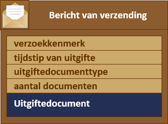

# Proces uitgifte van gegevens
## Operaties
De uitgiftewebservice voorziet in elementaire functionaliteit en die dekt drie gebruikscasussen. 
1. het geval waarin een gebruiker aanvankelijk niet precies weet welke objecten hij wil hebben en daarom op zoek gaat naar de objecten die aan bepaalde kenmerken voldoen. 
2. het geval waarin de gebruiker weet welke objecten aan zijn kenmerken voldoen en hij alleen de actuele gegevens van een object wil opvragen. Actueel wil zeggen de gegevens met de waarde die op het moment van opvragen geldt. De grondwatermonitoringput is namelijk een registratieobject met een materiële geschiedenis en dat betekent dat de waarde van bepaalde gegevens in de loop van de tijd kan wijzigen. 
3. het geval waarin de gebruiker weet welke objecten aan zijn kenmerken voldoen en hij zowel de actuele als de historische waarden van de gegevens van een object wil opvragen.

De drie opties zijn vertaald naar twee typen opraties:
1.	Een verzoek tot **verzending van de kengegevens** van een aantal grondwatermonitoringputten.
De data-afnemer geeft in zijn verzoek de verzameling kenmerken mee waaraan de grondwatermonitoringputten die hij zoekt moeten voldoen. In antwoord daarop krijgt hij van ieder van de objecten die aan de kenmerken voldoen de gegevens geleverd die het object karakteriseren, met ter identificatie het BRO-ID. 
2.	Een verzoek tot **verzending van de gegevens** van een bepaalde grondwatermonitoringput.
De data-afnemer geeft in zijn verzoek het BRO-ID van het grondwatermonitoringput die hij wil hebben mee en specificeert of hij alleen de actuele gegevens of de actuele en de historische gegevens wil hebben.  In antwoord daarop krijgt hij de gevraagde gegevens van de put geleverd.

## Verwerking

### Opvragen van kengegevens
Het opvragen van kengegevens verloopt volgens een vaste opeenvolging van stappen.
Dit is waar het in het kort op neerkomt:

1.	De data-afnemer stuurt vanuit zijn systeem een verzoek tot verzending van kengegevens. Daarbij geeft hij de kenmerken mee van de grondwatermonitoringputten waarvan hij gegevens wil krijgen.
2.	Het systeem van de BRO voert een toegangscontrole uit.
3.	Wanneer toegang tot het systeem van de BRO is verkregen, begint de controle van het verzoek en wordt onder meer vastgesteld of het verzoek inhoudelijk aan de gestelde eisen voldoet. 
O	Wanneer de inhoudelijke controle fouten oplevert, wordt het verzoek afgewezen en ontvangt het systeem van de data-afnemer een bericht van afwijzing.
4.	Wanneer de inhoudelijke controle geen fouten oplevert en er ook geen technische problemen zijn, verzamelt het systeem van de BRO de kengegevens van de grondwatermonitoringputten die aan de meegegeven kenmerken voldoen. 
O	Wanneer de verzameling gegevens te groot is, wijst het BRO-systeem het verzoek tot verzending alsnog af en ontvangt het systeem van de data-afnemer een bericht van afwijzing.
O	Wanneer de verzameling onder het gestelde maximum ligt stuurt het BRO-systeem de data-afnemer de opgevraagde gegevens in een bericht van verzending. 

Het verzoek van de data-afnemer en het antwoord dat de BRO daarop normaliter geeft worden berichten genoemd. In het geval zich technische problemen voordoen, wordt het antwoord een melding genoemd. 

De stappen en de bijbehorende berichten worden in het onderstaande plaatje uitgebeeld.

### Opvragen van gegevens 
Het opvragen van de gegevens van een grondwatermonitoringput verloopt iets anders dan het opvragen van kengegevens.

De berichten die worden uitgewisseld zijn alleen qua inhoud anders dan berichten bij een verzoek tot levering van kengegevens. Een bijzonderheid is dat bronhouders en data-afnemers iets meer gegevens geleverd krijgen dan andere afnemers. 

## Opvragen van kengegevens
Het opvragen van de kengegevens van een aantal grondwatermonitoringputten verloopt op basis van één of meer kenmerken.

Het belangrijkste onderdeel van het verzoek tot verzending van kengegevens is de kenmerkenverzameling, dat is het geheel van kenmerken waaraan de grondwatermonitoringput die de afnemer wil krijgen moet voldoen. Door het meegeven van kenmerken kan de data-afnemer de zoekvraag preciseren naar plaats, tijd en aard van de constructie. 
De kenmerken die de data-afnemer kan kiezen, worden in hoofdstuk 5 gespecificeerd. Het is een keuze uit de gegevens die in de catalogus voor de grondwatermonitoringput zijn beschreven, met daarbij aangegeven hoe de waarde moet worden gespecificeerd. 
De data-afnemer moet als kenmerk in ieder geval opgeven in welk gebied de locatie van de grondwatermonitoringput moet liggen. Dat kenmerk kan hij combineren met een of meer andere kenmerken.

Naast deze kenmerken moet de data-afnemer een *verzoekkenmerk* meegeven. Dat gegeven kan worden gebruikt in de communicatie met de servicedesk, bijvoorbeeld als er iets mis is gegaan en de data-afnemer wil over het probleem contact zoeken met de servicedesk.

### Bericht van afwijzing

In de verwerking van het verzoek zijn allerlei controles ingebouwd. Als er in technische zin iets mis gaat, krijgt de data-afnemer een melding. Een bericht van afwijzing krijgt hij als antwoord, wanneer bij de controles blijkt dat zich een probleem voordoet dat bij het invoeren van gegevens moet worden opgelost. 

Het bericht van afwijzing bevat het tijdstip van afwijzing en het verzoekkenmerk van de data-afnemer, maar het belangrijkste onderdeel is de reden afwijzing. De reden waarom het verzoek is afgewezen hangt af van de aard van het probleem. Het probleem kan zijn dat er een fout zit in de gegevens die de data-afnemer heeft meegegeven, maar het kan ook zijn dat  bij het verzamelen van gegevens blijkt dat het maximum aantal registratieobjecten wordt overschreden.

Fouten in de gegevens die de data-afnemer heeft meegegeven worden in het bericht zo omschreven dat de afnemer direct kan zien waar de fout zit en wat de fout inhoudt. 
Het bericht van afwijzing dat gestuurd wordt na de tweede controle heeft een eenvoudige boodschap. Het aantal objecten waarvan kengegevens worden geleverd is beperkt tot 2000. De foutmelding geeft in dit geval alleen aan dat het maximum is overschreden. 

### Bericht van verzending

Het belangrijkste onderdeel van het bericht van verzending zijn de uitgiftedocumenten. Ieder uitgiftedocument bevat de kengegevens van een grondwatermonitoringput die de gewenste kenmerken heeft. Het bericht bevat verder het tijdstip van uitgifte, het verzoekkenmerk van de data-afnemer en de vermelding van het aantal uitgiftedocumenten. Er worden maximaal 2000 uitgiftedocumenten verzonden.

De lijst met kengegevens die standaard worden uitgegeven wordt gespecificeerd in hoofdstuk 5.

Er is één uitzondering op de standaardlijst en dat is wanneer een registratieobject door de registerbeheerder uit registratie is genomen. Dat geval doet zich bijvoorbeeld voor wanneer een object ten onrechte is opgenomen in de registratie en de registerbeheerder, na onderzoek en overleg met de bronhouder, van die laatste het akkoord heeft gekregen het object uit registratie te nemen. In dat uitzonderlijke geval ontvangt de data-afnemer een bijzonder type uitgiftedocument dat enkel de volgende gegevens over het betreffende registratieobject bevat:

| Entiteit  | Attribuut |
| --- | --- |
| Grondwatermonitoringput | BRO-ID |
| Registratiegeschiedenis |uit registratie genomen 
|    |  tijdstip uit registratie genomen|

Tot slot kan het voorkomen dat er geen enkel registratieobject bestaat dat aan de kenmerken voldoet die zijn meegegeven. Dan ontvangt de data-afnemer wel een bericht van verzending, maar worden er geen uitgiftedocumenten meegeleverd. 

##Opvragen van gegevens 
Het opvragen van de gegevens van een grondwatermonitoringput verloopt op basis van het BRO-ID. 

### Verzoek tot verzending

### Bericht van afwijzing
### Bericht van verzending

