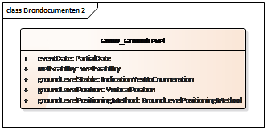

# Interface inname van gegevens

## API voor gegevensinname Grondwatermonitoringput
Dit hoofdstuk beschrijft in technische termen de Application Programming Interface (API) van de innamewebservice. Daarbij wordt voortgebouwd op zaken die in eerdere hoodstukken en paragrafen beschreven zijn:
* Paragraaf *'4.1 Operaties'*: de operaties van de webservicefunctionaliteit 
* Paragraaf *'4.2 Verwerking'*: de procesgang bij gegegevensinname (*registratie* en *correctie*)
* Hoofdstuk '3 Uitgangspunten': gehanteerde uitgangspunten en standaarden
* De in hoofdstuk 4 *'Proces gegevensinname'* genoemde berichten worden in dit hoofdstuk vertaald naar de technische realisatie daarvan. Daarbij vindt ook letterlijk vertaling plaats van nederlands naar engels. Verder kan het voorkomen dat berichtattributen in de functionele definitie niet terugkomen in de technische definitie. De reden daarvan zal per berichttype aangegeven worden.
* Hoofdstuk xxxx: datatypen

## Berichten bij registratie starten
Bij een *register* operatie zijn drie berichten van toepassing: 
* een registratieverzoek
* een bericht van afwijzing
* een bericht van registratie

Deze paragraaf beschrijft de inhoud van de berichten bij de gebeurtenis *‘registratie starten’*.

### Request: registratieverzoek
Onderstaande figuur geeft de mapping weer van het registratieverzoek op het datatype RegistrationRequest in dit document (zie paragraaf 6.1), zoals gebruikt door de register operatie (zie hoofdstuk 5).

Het element *brondocumenttype* in het registratieverzoek komt niet voor in het *RegistrationRequest*, omdat dit gegeven impliciet bekend is, gegeven de inhoud van het element *sourceDocument*.

Het element *sourceDocument* bevat alle gegevens die in de catalogus voor het registratieobject Grondwatermonitoringput zijn gespecificeerd, met uitzondering van de gegevens die door het BRO-systeem worden gegenereerd of afgeleid uit het *RegistrationRequest*.

### Response: bericht van afwijzing
Het innamehandboek benoemt als mogelijke reactie op een *registratieverzoek* een *bericht van afwijzing*. De webservice gebruikt hiervoor een response van het datatype *IntakeResponse*.

In hoofdstuk 4 'Proces gegevensinname' zijn een aantal berichten gedefiniëerd als antwoord op een innameverzoek. In de SOAP webservice definities mag elk '*request* slechts één *response* hebben. Daarom is het element *responseType* toegevoegd, om de betekenis van de *response* te duiden. In dit geval heeft het element *responseType* de vaste waarde 'rejection'.

De waarde van de elementen *requestReference* en *objectIdAccountableParty* wordt overgenomen uit het *request* c.q. het *sourceDocument* in het *request*. De waarde van de overige elementen wordt toegekend door de webservice. Het element *rejectionReason* bevat een waarde uit de tabel met gebruiksfouten; zie het innamehandboek.

Als deze *response* wordt gegeven omdat er een of meer gebruiksfouten in het *sourceDocument* zijn geconstateerd, dan is de waarde van *rejectionReason*: “er zijn 1 of meer fouten geconstateerd in het brondocument” en volgen er na dit element één of meer *sourceDocumentErrors*. 

Zie paragraaf 8.15 voor nadere details.

### Response: bericht van registratie
Hoofdstuk 4 *'Proces gegevensinname'* benoemt als mogelijke reactie op een registratieverzoek een *bericht van registratie*. De webservice gebruikt hiervoor een response van het datatype *IntakeResponse*.

In hoofdstuk 4 'Proces gegevensinname' zijn een aantal berichten gedefiniëerd als antwoord op een innameverzoek. In de SOAP webservice definities mag elk *request* slechts een *response* hebben. Daarom is het element *responseType* toegevoegd, om de betekenis van de *response8 te duiden. In dit geval heeft het element *responseType* de vaste waarde 'completion'.

De waarde van de elementen requestReference en objectIdAccountableParty wordt overgenomen uit het *request* c.q. het *sourceDocument* in het *request*. De waarde van de overige elementen wordt toegekend door de webservice. Het element *broId* bevat de identificatie van het registratieobject in de BRO.

Zie paragraaf 8.15 voor nadere details.

## Berichten bij registratie aanvullen en beëindigen
Bij een *register* operatie zijn drie berichten van toepassing: 
* een registratieverzoek
* een bericht van afwijzing 
* een bericht van registratie. 

Deze paragraaf beschrijft de inhoud van deze berichten bij de gebeurtenissen ‘registratie aanvullen’ en ‘registratie beëindigen’.

### Request: registratieverzoek
Onderstaande figuur geeft de mapping weer van het *registratieverzoek* op het datatype *RegistrationRequest*, zoals gebruikt door de *register* operatie.

Het element *brondocumenttype* in het registratieverzoek komt niet voor in het *RegistrationRequest*, omdat dit gegeven impliciet bekend is gegeven de inhoud van het element *sourceDocument*.

Het element *broId* bevat de identificatie van het registratieobject in de BRO dat moet worden aangevuld of beëindigd. Het element *sourceDocument* bevat de aanvullende putgegevens c.q. gegevens met betrekking tot het feit dat de put is opgeruimd.

### Response: bericht van afwijzing
Het innamehandboek benoemt als mogelijke reactie op een registratieverzoek een *bericht van afwijzing*. De webservice gebruikt hiervoor een *response* van het datatype *IntakeResponse*.

Het handboek definieert een aantal berichten als antwoord op een innameverzoek. In de SOAP webservice definities mag elk *request* slechts één *response* hebben. Daarom is het element *responseType* toegevoegd, om de betekenis van de *response* te duiden. In dit geval heeft het element *responseType* de vaste waarde 'rejection'.

De waarde van de elementen *requestReference* en *broId* wordt overgenomen uit het *request*. De waarde van de overige elementen wordt toegekend door de webservice. Het element *rejectionReason* bevat een waarde uit de tabel met gebruiksfouten; zie het innamehandboek.

Als deze response wordt gegeven omdat er een of meer gebruiksfouten in het sourceDocument zijn geconstateerd, dan is de waarde van *rejectionReason*: “er zijn 1 of meer fouten geconstateerd in het brondocument” en volgen er na dit element een of meer *sourceDocumentErrors*. 

Zie paragraaf 8.15 voor nadere details.

### Response: bericht van registratie
Het innamehandboek benoemt als mogelijke reactie op een registratieverzoek een bericht van registratie. De webservice gebruikt hiervoor een response van het datatype IntakeResponse.

Het handboek definieert een aantal berichten als antwoord op een innameverzoek. In de SOAP webservice definities mag elk *request* slechts één *response* hebben. Daarom is het element *responseType* toegevoegd, om de betekenis van de *response* te duiden. In dit geval heeft het element *responseType* de vaste waarde 'completion'.

De waarde van de elementen *requestReference* en *broId* wordt overgenomen uit het *request*.

Zie paragraaf 8.15 voor nadere details.

## Berichten bij correctie
Bij correctie operaties (de operaties replace, insert, move en delete) zijn drie berichten van toepassing: een correctieverzoek, een bericht van afwijzing en een bericht van acceptatie.

### Request: correctieverzoek
Onderstaande figuur geeft de mapping weer van het *correctieverzoek* op het datatype *CorrectionRequest*, zoals gebruikt door de *replace*, *insert* en *delete* operaties.

Het element *brondocumenttype* in het correctieverzoek komt niet voor in het *correctionRequest*, omdat dit gegeven impliciet bekend is gegeven de inhoud van het element *sourceDocument*.

Het elementen *correctietype* in het correctieverzoek komt niet voor in het *correctionRequest*, omdat dit gegeven impliciet bekend is binnen de context van de operatie waarmee het *correctionRequest* wordt aangeboden.

Het element *broId* bevat de identificatie van het te corrigeren registratieobject.

Het element *dateToBeCorrected* komt alleen voor als het *correctionRequest* wordt gebruikt in een *move* operatie. Dit element bevat de (mogelijkerwijs onvolledige) datum van de momenteel geregistreerde gebeurtenis die verbeterd moet worden.

Het element *sourceDocument* bevat dezelfde gegevens als het *sourceDocument* van het dienovereenkomstige te corrigeren registratieverzoek maar nu met de correcte waarden.

### Response: bericht van afwijzing
Het innamehandboek benoemt als mogelijke reactie op een registratieverzoek een bericht van afwijzing. De webservice gebruikt hiervoor een response van het datatype *IntakeResponse*.

Het handboek definieert een aantal berichten als antwoord op een innameverzoek. In de SOAP webservice definities mag elk *request* slechts één *response* hebben. Daarom is het element *responseType* toegevoegd, om de betekenis van de *response* te duiden. In dit geval heeft het element *responseType* de vaste waarde 'rejection'.

De waarde van de elementen *requestReference* en *broId* wordt overgenomen uit het *request*. De waarde van de overige elementen wordt toegekend door de webservice. Het element *rejectionReason* bevat een waarde uit de tabel met gebruiksfouten; zie het innamehandboek.

Als deze *response* wordt gegeven omdat er een of meer gebruiksfouten in het *sourceDocument* zijn geconstateerd, dan is de waarde van *rejectionReason*: “er zijn 1 of meer fouten geconstateerd in het brondocument” en volgen er na dit element een of meer *sourceDocumentErrors*. 

Zie paragraaf 8.15 voor nadere details.

### Response: bericht van acceptatie
Het innamehandboek benoemt als mogelijke reactie op een correctieverzoek een bericht van acceptatie. De webservice gebruikt hiervoor een *response* van het datatype *IntakeResponse*.

Het handboek definieert een aantal berichten als antwoord op een innameverzoek. In de SOAP webservice definities mag elk *request* slechts één *response* hebben. Daarom is het element *responseType* toegevoegd, om de betekenis van de *response* te duiden. In dit geval heeft het element *responseType* de vaste waarde 'acceptance'.

De waarde van de elementen *requestReference* en *broId* wordt overgenomen uit het *request*. De waarde van de overige elementen wordt toegekend door de webservice. In *acceptanceTime* staat het (datum en) tijdstip waarop het correctieverzoek is aangenomen.

Zie paragraaf 8.15 voor nadere details.

## Berichten bij technische fouten
Er zijn twee soorten technische fouten waarvoor meldingen worden afgegeven: 
1. een softwarefout 
2. een systeemfout. 

In de volgende paragrafen wordt dit toegelicht.

### Softwarefout
Als bij de technische controle van het request fouten in het verzoek en/of het brondocument worden gevonden (bijvoorbeeld het request is niet een welgevormd XML bericht of het request voldoet niet aan de schemavalidatie), dan worden deze beschouwd als een softwarefout in het systeem van de dataleverancier. Het BRO-systeem stuurt dan een melding in de vorm van een *parseFault*. Zie paragraaf 8.16 voor nadere details.

### Systeemfout
Tijdens de uitvoering van een operatie kan er een onverwachte fout optreden in het BRO-systeem. Hiervoor kunnen verschillende oorzaken zijn, zoals het falen van bepaalde software of hardware. Deze onverwachte fouten worden beschouwd als een systeemfout in het BRO-systeem. De BRO stuurt dan een bericht in de vorm van een generieke, niet gemodelleerde *SOAP:Fault*. Zie paragraaf 8.24 voor nadere details.

## Interfacemodel
Dit hoofdstuk en de volgende hoofdstukken beschrijven in detail de interface van de GMW innamewebservice aan de hand van een UML-model.
### Packagestructuur
De interface beschrijving is onderverdeeld in verschillende packages. Deze paragraaf beschrijft de samenhang van de packages. Deze onderverdeling is ook van toepassing op de WSDL en XSD-bestanden. De hoofdstukken 5 en verder beschrijven elk een van de packages.

Onderstaande figuur geeft een overzicht van de packagestructuur. 

De interfaces van de innamewebservice en de uitgiftewebservice zijn gemodelleerd in de packages *isgmw* en *dsgmw*.

Om de beheerbaarheid van de modellen en de software te vergroten, is gestreefd naar herbruikbaarheid van gemodelleerde gegevenstypes. Er is bijvoorbeeld veel overlap in de gegevens in het registratieverzoek en de objectgegevens bij uitgifte. Door deze overlappende gegevens onder te brengen in een gemeenschappelijk model voor inname en uitgifte is hergebruik mogelijk.

De gegevenstypes voor de inname- respectievelijk uitgiftewebservice zijn gemodelleerd in package *isgmw-messages* respectievelijk *dsgmw-messages*.

Herbruikbare gegevenstypes die specifiek zijn voor GMW zijn gemodelleerd in package *gmwcommon*.

Gegevenstypes die herbruikbaar zijn voor alle registratieobjecten van de BRO zijn gemodelleerd in package *brocommon*.

GMW maakt verder op diverse manieren gebruik van concepten uit de GML-standaard van de OGC (ISO 19136). Aan het gebruik van deze standaard kleven enkele praktische bezwaren:
* De standaard is omvangrijk en slechts een klein deel wordt gebruikt in de BRO.
* De software om de standaard te ondersteunen is omvangrijk.
* Het gebruik van de standaard is niet eenvoudig.
Om deze bezwaren weg te nemen zijn in overleg met GeoNovum profielen opgesteld. Randvoorwaarde bij het opstellen van de profielen was dat berichten die voldoen aan de profielen ook moeten voldoen aan de OGC-standaarden. Het GML-profiel is gemodelleerd in package *gml-profile*.

De volgende hoofdstukken beschrijven deze packages als gegevensmodel voor de GMW innamewebservice. De packages *dsgmw* en *dsgmw-messages* worden hier buiten beschouwing gelaten, aangezien deze de uitgiftewebservice betreffen. 

### Modelleerregels
In het UML-model worden de volgende stereotypes gebruikt om bepaalde functionaliteit te duiden.
#### CodeList
De catalogus maakt een onderscheid in *beheerde enumeraties* en *niet-beheerde* enumeraties

Het domein van een **beheerde enumeratie** is een uitbreidbare opsomming van toegestane waarden. Er wordt voor een beheerde enumeratie gekozen als niet alle waarden bekend zijn en uitbreiding mogelijk moet zijn (zie paragraaf 4.2.3 voor niet-beheerde enumeraties).

Het stereotype *CodeList* wordt in UML gebruikt om aan te geven dat een datatype een beheerde enumeratie is. In de XSD leidt dit tot een complexType wat een restrictie is van het gml complexType CodeWithAuthority (zie paragraaf 9.3).

#### Enumeration
De catalogus maakt een onderscheid in beheerde en niet-beheerde enumeraties.

Het domein van een **niet-beheerde enumeratie** is een vaste, limitatieve opsomming van toegestane waarden. Er wordt voor een niet-beheerde enumeratie gekozen als alle waarden bekend zijn en uitbreiding niet nodig is (zie paragraaf 4.2.1 voor beheerde enumeraties).

Het stereotype Enumeration wordt in UML gebruikt om aan te geven dat een datatype een niet-beheerde enumeratie is. In de XSD leidt dit tot een simpleType als restrictie van het type string met een lijst van benoemde waarden. Voorbeeld:
<simpleType name="IndicationYesNoEnumeration">
  <restriction base="string">
    <enumeration value="ja">
    <enumeration value="nee">
  </restriction>
</simpleType>

#### DataType
Het stereotype DataType wordt in UML gebruikt om aan te geven dat een datatype een niet-identificeerbaar, gestructureerd data type is. In de XSD leidt dit tot een complexType zonder een gml:id attribuut.

#### FeatureType
Het stereotype FeatureType wordt in UML gebruikt om aan te geven dat een klasse een identificeerbaar fenomeen in de werkelijkheid representeert, dat direct of indirect is geassocieerd met een locatie relatief ten opzichte van de aarde. In de XSD leidt dit tot een complexType dat is afgeleid van AbstractFeature uit het GML-profiel (zie paragraaf 9.1). In een XML-bericht heeft een object van deze klasse een gml:id attribuut.
#### Type
Het stereotype Type wordt in UML gebruikt om aan te geven dat een klasse een identificeerbaar object anders dan een FeatureType (zie paragraaf 4.2.4) representeert. In de XSD leidt dit tot een complexType dat is afgeleid van AbstractGML uit het GML-profiel (zie paragraaf 9.2). In een XML-bericht heeft een object van deze klasse een gml:id attribuut (zie paragraaf 9.1).
#### Union
Het stereotype Union wordt in UML gebruikt om aan te geven dat in een voorkomen precies een van de eigenschappen aanwezig is (polymorfisme). In de XSD wordt dit gerealiseerd als een choice.
#### Voidable
Het stereotype Voidable wordt in UML gebruikt om aan te geven dat een element aanwezig is maar geen waarde heeft. De modellering in UML en XSD en het gebruik in XML is afhankelijk van het datatype of domein van het betreffende attribuut:
*Codelijst, enumeratie
o	De uitwerking is opgenomen in de lijst met toegestane waarden.
o	In het UML-model is het stereotype Voidable niet opgenomen.
o	In een XSD-bestand krijgt zo’n element niet het attribuut nilllable=”true”.
o	Als in een XML-bericht het element wordt opgenomen, dan heeft het element een waarde uit de codelijst.
*Integer, double, string
o	Het gegeven is aanwezig, maar heeft geen waarde.
o	In het UML-model is het stereotype Voidable opgenomen voor deze situatie.
o	In een XSD-bestand krijgt zo’n element het attribuut nilllable=”true”.
o	In een XML-bericht wordt in voorkomende gevallen het element opgenomen, met een lege waarde en met het attributen xsi:nil=”true”.
o	Er wordt geen onderscheid gemaakt in de waarden geen, onbekend, o.i.d.
*PartialDate
o	Voor IMBRO/A-gegevens kan de situatie zich voordoen, dat er wel een waarde is, maar dat deze onbekend is bij de dataleverancier.
	Voor deze situatie voorziet het UML-model de optie voidReason met als vaste waarde onbekend.
	In een XSD-bestand krijgt zo’n element niet het attribuut nilllable=”true”.
	In een XML-bericht wordt het element opgenomen, met als kind-element voidReason met als waarde onbekend.
o	Daarnaast kan (tot nu toe alleen bij IMBRO/A) sprake zijn van het feit, dat het gegeven überhaupt geen waarde heeft.
	In het UML-model wordt het stereotype Voidable opgenomen.
	In een XSD-bestand krijgt zo’n element het attribuut nilllable=”true”.
	In een XML-bericht wordt het element opgenomen met een lege waarde (er is geen kind-element voidReason aanwezig).  

## Package isgmw
De onderstaande figuur geeft het interface van de GMW innamewebservice weer:

Onderstaande tabel bevat een samenvatting van operaties met bijbehorende naam en datatype van het request:

| Operatie   | Request naam   | Request Datatype   |
| ----- | ----- | ----- |
| Register | registrationRequest | RegistrationRequest |
| Replace | replaceRequest | CorrectionRequest |
| Insert | insertRequest | CorrectionRequest |
| Move | moveRequest | MoveRequest |
| Delete | deleteRequest | CorrectionRequest |

Zie paragraaf 6.1 voor het datatype *RegistrationRequest*, paragraaf 6.2 voor het datatype *CorrectionRequest8 en paragraaf 6.3 voor het datatype *MoveRequest* uit de package *isgmw-messages*.

Alle operaties gebruiken de generieke response *IntakeResponse* uit de package *brocommon* voor de functionele antwoordberichten. Zie paragraaf 3.7 voor de afhandeling van technische fouten.

### WSDL
De GMW innamewebservice wordt technisch volledig beschreven door de WSDL van de GMW innamewebservice (isgmw.wsdl).  De onderdelen van dit bestand worden hieronder kort toegelicht.
#### Types
Het onderdeel *types* in een WSDL definieert een XML-schema met daarbinnen XML-types en XML-elementen. Voor de GMW innamewebservice zijn deze opgenomen in een afzonderlijke berichten XSD (*isgmw-messages.xsd*) die in het types *element* wordt geïmporteerd. 
#### Message
Het onderdeel *message* in een WSDL specificeert de berichten die per operatie worden uitgewisseld, uitgedrukt in *parts*. In de parts worden XML-elementen uit het types onderdeel van de WSDL gebruikt. Voor elke operatie wordt een *request message* en een *response message* gespecificeerd. 
#### PortType
Het onderdeel *portType* in een WSDL specificeert de beschikbare functionaliteit van de webservice in de vorm van een of meer operaties (operations) met hun *request* en *response* messages en de *parseFault*. 
#### Binding
Het onderdeel *binding* in een WSDL specificeert details over het transportmechanisme dat gebruikt wordt voor de webservice, waaronder het communicatieprotocol en het formaat van de input en de output. Digikoppeling schrijft als binding SOAP 1.1, ‘document-literal wrapped’ met als transport binding http voor. Voor elke operatie is de style ‘document’ en de input en output use ‘literal’. 
#### Service
Het onderdeel service in een WSDL beschrijft volgens welke #portType# en op welke URL de webservice gepubliceerd is.

### XSD-bestanden
In de XSD-bestanden worden alle XML types en elementen gedefinieerd die gebruikt worden in de WSDL voor de GMW innamewebservice. In alle XSD-bestanden van de BRO wordt, conform de NEN3610 voorschriften, gebruik gemaakt van verschillende XSD-bestanden van de internationale W3C en OGC-standaarden. 
Deze schema’s worden in de navolgende hoofdstukken beschreven, elk schema in een eigen hoofdstuk. De opbouw van een element of type uit een schema wordt afgebeeld in een diagram en waar relevant worden bijzonderheden in de tekst toegelicht. Voor de inhoudelijke betekenis van de afzonderlijke gegevens wordt verwezen naar het innamehandboek en de catalogus van de GMW. 

De XSD-bestanden zijn opgesteld in het Engels. De vertaling naar Nederlandse termen die gebruikt worden in het innamehandboek en in de catalogus staat in Bijlage A (zie paragraaf 11.1).

## Package isgmw-messages - de berichten XSD

De package isgmw-messages bevat de requests en brondocumenten voor de registratieverzoeken en de correctieverzoeken.
### RegistrationRequest
Het RegistrationRequest in de GMW namespace is een specialisatie van de abstract klasse RegistrationRequest, uit de package brocommon, waar het een sourceDocument aan toevoegt.

*SourceDocument* heeft het stereotype *Union* (zie paragraaf 4.2.6), waarmee wordt aangegeven dat het brondocument polymorf is en dat bij een gegeven *request* een van de alternatieve datatypes gekozen moet worden.

In de XSD is dit gerealiseerd als een choice uit een lijst van paarsgewijs de naam van het element en het bijbehorende datatype, zoals aangegeven in bovenstaande figuur. Deze alternatieven worden toegelicht in de volgende paragrafen. Merk op dat de naam van het alternatief opgenomen moet worden in het element sourceDocument; daarmee wordt bij een gegeven *request* eenduidig bekend welk alternatief gekozen is, voordat de feitelijke elementen van dat alternatief aan bod komen. Voorbeeld:

### CorrectionRequest
Het CorrectionRequest in de GMW namespace is een specialisatie van de abstract klasse *CorrectionRequest* uit de package *brocommon*, waar het *correctionReason* en een *sourceDocument* aan toevoegt.

SourceDocument heeft het stereotype *Union* (zie ook paragraaf 4.2.6), waarmee wordt aangegeven dat het brondocument polymorf is en dat bij een gegeven request een van de alternatieve datatypes gekozen moet worden.

### MoveRequest
Het MoveRequest is een specialisatie van CorrectionRequest uit de GMW namespace, waar het een dateToBeCorrected aan toevoegt. De betekenis van dateToBeCorrected is de (mogelijkerwijs onvolledige) datum gebeurtenis van de oorspronkelijk geregistreerde gegevens die verbeterd moet worden. De juiste datum is opgenomen in het sourceDocument.

### CorrectionReason
Het datatype *CorrectionReason* definieert het domein voor het element *correctionReason*.

Het datatype CorrectionReason heeft het stereotype CodeList (zie paragraaf 4.2.1).
### SourceDocument
Het datatype SourceDocument biedt een keuze uit een reeks alternatieve brondocumenten datatypes.

*SourceDocument* heeft het stereotype *Union* (zie paragraaf 4.2.6), waarmee wordt aangegeven dat *SourceDocument* polymorf is en dat in een gegeven XML bericht één van de alternatieve datatypes gebruikt is.

Niet elk type sourceDocument mag gebruikt worden in elke operatie. Onderstaande tabel geeft weer in welke operatie welke type sourceDocument opgenomen mag worden.

| SourceDocument     | register | replace | insert | move | delete|
| -------------------| :------: |:-------:|:------:|:----:|:-----:|
|GMW_Construction    |    X     |    X    |        |  X   |       |
|GMW_Owner           |    X     |    X    |   X    |  X   |  X    |
|GMW_Lengthening     |    X     |    X    |   X    |  X   |  X    |
|GMW_GroundLevel     |    X     |    X    |   X    |  X   |  X    |
|GMW_Shortening      |    X     |    X    |   X    |  X   |  X    |
|GMW_Positions       |    X     |    X    |   X    |  X   |  X    |
|GMW_ElectrodeStatus |    X     |    X    |   X    |  X   |  X    |
|GMW_Maintainer      |    X     |    X    |   X    |  X   |  X    |
|GMW_TubeStatus      |    X     |    X    |   X    |  X   |  X    |
|GMW_Insertion       |    X     |    X    |   X    |  X   |  X    |
|GMW_Shift           |    X     |    X    |   X    |  X   |  X    |
|GMW_Removal         |    X     |         |        |  X   |  X    |
|GMW_WellHeadProtector |  X     |    X    |   X    |  X   |  X    |

Bovenstaande regel wordt niet afgedwongen door de XSD, maar softwarematig gecontroleerd. Een *request* dat niet voldoet aan deze regels wordt gezien als een gebruiksfout (zie paragraaf 3.4.2,  3.5.2 of paragraaf 3.6.2).

NB: Met GMW_Construction wordt de initiële inrichting van een put geregistreerd (register operatie), gecorrigeerd (replace operatie) of verplaatst in de tijdlijn (move operatie). Met GMW_Removal wordt de put opgeruimd (register operatie), de opruiming verplaatst in de tijdlijn (move operatie) of verwijderd uit de tijdlijn (delete operatie). Met de overige brondocumenten wordt een aanvullingen geregistreerd (register operatie), gecorrigeerd (replace operatie), toegevoegd in de tijdlijn (insert operatie), verplaatst in de tijdlijn (move operatie) of verwijderd uit de tijdlijn (delete operatie).

#### GMW_Construction
De variant GMW_Construction van het element *sourceDocument* is van het datatype *GroundwaterMonitoringWell*.

De elementen NITGCode en mapSheetCode zijn beiden optioneel, maar er moet altijd een van beiden aanwezig zijn en een waarde hebben. Het element NITGCode is alleen aanwezig wanneer de put geregistreerd was in de registratie DINO, anders is het element mapSheetCode aanwezig.

De datatypes DeliveredLocation en DeliveredVerticalPosition zijn gemodelleerd in de package gmwcommon, omdat zij veel overlap vertonen tussen de innameservice en de uitgifteservice. De datatypes GroundwaterMonitoringWell en MonitoringTube zijn gemodelleerd in de package isgmw-messages, omdat zij (of een van hun kinderen) een andere structuur hebben dan de tegenhanger in de uitgifteservice.

Enkele elementen hebben het GML-stereotype Voidable; zie paragraaf 4.2.7 voor nadere uitleg.

#### GMW_ElectrodeStatus
Met de variant GMW_ElectrodeStatus van het element sourceDocument kan de verandering in de fysieke status van een of meer elektrodes van een reeds geregistreerde put worden geregistreerd.

#### GMW_GroundLevel
Met de variant GMW_GroundLevel van het element sourceDocument kan een nieuwe maaiveldpositie van een reeds geregistreerde put worden toegevoegd.

#### GMW_Construction
De variant GMW_Construction van het element sourceDocument is van het datatype GroundwaterMonitoringWell.

De elementen NITGCode en mapSheetCode zijn beiden optioneel, maar er moet altijd een van beiden aanwezig zijn en een waarde hebben. Het element NITGCode is alleen aanwezig wanneer de put geregistreerd was in de registratie DINO, anders is het element mapSheetCode aanwezig.

De datatypes DeliveredLocation en DeliveredVerticalPosition zijn gemodelleerd in de package gmwcommon, omdat zij veel overlap vertonen tussen de innameservice en de uitgifteservice. De datatypes GroundwaterMonitoringWell en MonitoringTube zijn gemodelleerd in de package isgmw-messages, omdat zij (of een van hun kinderen) een andere structuur hebben dan de tegenhanger in de uitgifteservice.

Enkele elementen hebben het GML-stereotype Voidable; zie paragraaf 4.2.7 voor nadere uitleg.

#### GMW_Owner
Met de variant GMW_Owner van het element sourceDocument kan een nieuwe eigenaar worden toegevoegd aan een reeds geregistreerde put.

#### GMW_Lengthening
Met de variant GMW_Lengthening van het element sourceDocument kan de oplenging van het stijgbuisdeel van een of meer monitoringbuizen van een reeds geregistreerde grondwatermonitoringput worden geregistreerd.

#### GMW_GroundLevel

#### GMW_Shortening
Met de variant GMW_Shortening van het element sourceDocument kan het inkorten van het stijgbuisdeel van een of meer monitoringbuizen van een reeds geregistreerde put worden geregistreerd.

#### GMW_Positions
Met de variant GMW_Positions van het element sourceDocument kunnen een nieuwe maaiveldpositie en de posities van een of meer monitoringbuizen van een reeds geregistreerde put worden geregistreerd.

#### GMW_ElectrodeStatus

#### GMW_Maintainer
Met de variant GMW_Maintainer van het element sourceDocument kan een nieuwe onderhoudende instantie van een reeds geregistreerde put worden toegevoegd.

#### GMW_TubeStatus
Met de variant GMW_TubeStatus van het element sourceDocument kan de verandering in de (fysieke) status van een of meer monitoringbuizen van een reeds geregistreerde put worden geregistreerd.

#### GMW_Insertion
Met de variant GMW_Insertion van het element sourceDocument kan het repareren van een monitoringbuis, door het plaatsen van een stijgbuisdeel met een kleinere diameter binnen een bestaande buis, van een reeds geregistreerde put worden geregistreerd.

#### GMW_Shift
Met de variant GMW_Shift van het element sourceDocument kan het verleggen van het maaiveld bij een put door ophoging of afgraving van een reeds geregistreerde put worden geregistreerd.

#### GMW_Removal
Met de variant GMW_Removal van het element sourceDocument kan het opruimen van een reeds geregistreerde put worden geregistreerd.

#### WellHeadProtector
Met de variant GMW_WellHeadProtector van het element sourceDocument kan het plaatsen van een nieuwe beschermconstructie van een reeds geregistreerde put worden geregistreerd.

#### GeoOhmCable
Het datatype GeoOhmCable bevat de gegevens over een geo-ohmkabel bevestigd aan een buis en voorzien van elektroden, die gebruikt wordt om bijvoorbeeld het zoutgehalte van het water te kunnen bepalen.
#### MonitoringTube
Het datatype MonitoringTube bevat alle gegevens over een buis die is aangebracht om het grondwater uit een specifiek deel van de ondergrond te ontsluiten.

De datatypes MaterialUsed, PlainTubePart en SedimentSump zijn gemodelleerd in de package gmwcommon, omdat zij veel overlap vertonen tussen de innameservice en de uitgifteservice. De datatypes Screen en GeoOhmCable zijn gemodelleerd in de package isgmw-messages, omdat zij (of een van hun kinderen) een andere structuur hebben dan de tegenhanger in de uitgifteservice.

Enkele elementen hebben het GML-stereotype Voidable; zie paragraaf 4.2.7 voor nadere uitleg.

#### Screen
Het datatype Screen bevat alle gegevens over het filter van een buis, namelijk dat deel van de monitoringbuis dat voorzien is van openingen waardoor het grondwater kan binnenstromen.

## Package gmwcommon
De package gmwcommon bevat de entiteiten en relaties, die gemeenschappelijk zijn voor zowel de GMW innamewebservice als de GMW uitgiftewebservice.

### Codelijsten
De catalogus maakt een onderscheid in beheerde en niet-beheerde enumeraties. Het stereotype CodeList wordt in UML gebruikt om aan te geven dat een datatype een beheerde enumeratie is (zie paragraaf 4.2.1).

De package gmwcommon bevat een aantal codelijsten. Zie paragraaf 11.1.4 voor een overzicht. Voorbeeld:

### DeliveredLocation
Het datatype DeliveredLocation bevat de gegevens, zoals die zijn aangeleverd door de data-leverancier aan de basisregistratie ondergrond, over de plaats op het aardoppervlak waar de grondwatermonitoringput zich bevindt.

Het datatype DeliveredLocation bevat een element location van het GML-datatype Point. Zie paragraaf 9.7 voor nadere details over het datatype GML:Point. Voorbeeld van het element deliveredLocation in een XML-bestand:

### DeliveredVerticalPosition
Het datatype DeliveredVerticalPosition bevat de gegevens over de verticale positie van de grondwatermonitoringput. Het element groundLevelPosition heeft het GML-stereotype Voidable datatype Point. Zie onderstaande figuur.

Het datatype Electrode bevat de gegevens over een geleider die in het stroomcircuit ter bepaling van de elektrische geleidbaarheid gebruikt wordt om contact te maken met het grondwater.

### Electrode
### InsertedPart
### MaterialUsed
### Meetwaarden
### PlainTubePart
### SedimentSump

## Package brocommon
De package brocommon bevat de entiteiten en relaties, die gemeenschappelijk zijn voor alle registratieobjecten.
### AbortReason
Zie ParseFault in paragraaf 8.16.
### Area
Het datatype Area geeft de begrenzing aan van een geografisch gebied aan het aardoppervlak.

### Characteristics
### ChamberOfCommerceNumber
### Circle
### CoordinateTransformation
### CorrectionRequest
### CriteriaSet
### CriterionError
### DatePeriod
### DeregisteredObject
### DispatchDataRequest
### DispatchResponse
### Enumeraties
### IntakeResponse
### ParseFault
### PartialDate
### Radius
### RegistrationHistory
### RegistrationObject
### RegistrationObjectCode
### RegistrationRequest
vRegistrationStatus
### SOAP Fault
### SourceDocumentError
### StandardizedLocation

### Package gml-profile
### AbstractFeature
### AbstractGML
### CodeWith Authority
### Doublelist
### Envelope
### Measure
### Point
### TM_TimeInstant
### TM_Position

## Package xlink-profile
### Href
### HrefType
### SimpleAttrs
### Type
### TypeType
